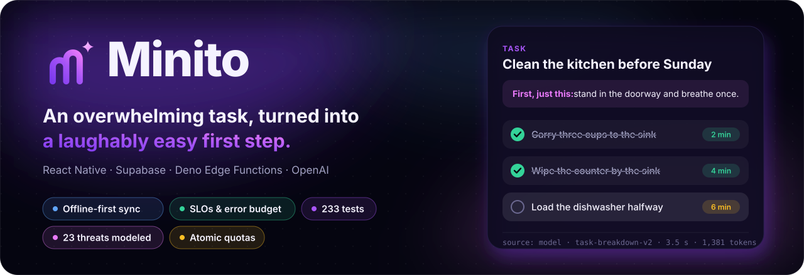
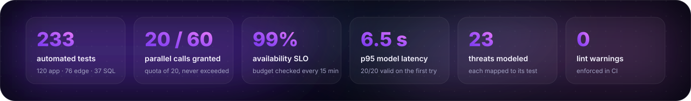
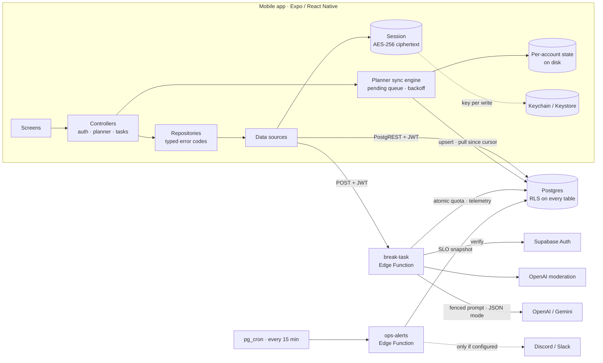
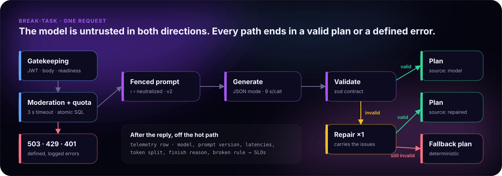

<p align="center">
  
</p>

<p align="center">
  <a href="https://github.com/ahmetHakanSenel/Minito/actions/workflows/ci.yml"></a>
  
  
  
  
</p>

<p align="center"><b>English</b> · <a href="docs/README.tr.md">Türkçe</a></p>

Minito is an ADHD-friendly task starter. You type a task that feels too big, and it answers with
three things:

- An empathy line.
- A laughably easy first action.
- Three to seven atomic steps, shown one at a time in a calm focus mode.

It is a React Native app on Supabase. This README is about the engineering behind it: how the
system fails safely, how every claim is tested, and how it is operated.

<p align="center">
  
</p>

## For reviewers: where to look

| Claim | Evidence |
| ----- | -------- |
| **The AI budget cannot be drained** by concurrency or by cycling accounts | [`014_atomic_rate_limits.sql`](supabase/migrations/014_atomic_rate_limits.sql). The database suite fires 60 parallel calls at a quota of 20 and gets exactly 20 grants |
| **The model is untrusted in both directions** | [`pipeline.ts`](supabase/functions/break-task/pipeline.ts): a data fence that tags cannot break, a zod contract, one repair, a deterministic fallback |
| **Every request-path rule is tested without a network** | [`handler.ts`](supabase/functions/break-task/handler.ts) takes its side effects as dependencies; [`handler.test.ts`](supabase/functions/break-task/handler.test.ts) covers auth, ordering, fail-open and error paths |
| **Offline-first sync that survives stale devices** | [`syncEngine.ts`](src/features/planner/syncEngine.ts) and [`016_planner_sync.sql`](supabase/migrations/016_planner_sync.sql): idempotent pushes, tombstones, a server-side guard against stale writes |
| **RLS and grants are verified, not assumed** | Migrations run on real Postgres with Supabase's default grants reproduced ([`bootstrap.sql`](supabase/tests/bootstrap.sql)). Schema-wide checks fail on any table without RLS or any function without a pinned `search_path` |
| **The system is operable** | [`RUNBOOK.md`](docs/RUNBOOK.md): SLOs, an error budget, log events, alert rules, playbooks, expand/contract deploys. The SQL behind it runs in CI |
| **Security is reasoned about** | [`THREAT_MODEL.md`](docs/THREAT_MODEL.md): 23 threats, each mapped to its control and to the test that proves it, plus accepted risks with revisit triggers |
| **Prompt changes are judged by measurement** | [`scripts/eval.ts`](scripts/eval.ts) and a committed [baseline](docs/eval/README.md#baseline) |

---

## Architecture



- **App layers.** Data sources, repositories, controllers and UI each have their own job. Typed
  errors cross every boundary, so a missing backend shows up as an explanation on the login
  screen, not as a crash at import time.
- **Planner.** Screens render only local state, so the planner works offline and never shows a
  spinner.

---

## The AI pipeline

<p align="center">
  
</p>

| Stage | What happens |
| ----- | ------------ |
| **Gatekeeping** | Readiness is checked first (`503`), so the anonymous health probe sees a misconfigured deployment. Then the JWT (`401`) and the body (`400`, trimmed before its length is checked) |
| **Moderation and quota** | They run in parallel. Safety outranks quota, and the IP quota is checked before the user quota. Both fail open, and every failure is logged |
| **Fence** | Every `<` and `>` in user text becomes `‹ ›`. Stripping tag names is not enough: removing them once can assemble a new tag (`</task_</task_input>input>`) |
| **Generate** | Provider JSON mode, 9 s per call, and one retry on network errors or 5xx. A `429` is never retried |
| **Validate and repair** | A zod contract: 3–7 steps, a first step that is `easy`, 1–10 minutes each. A failing reply gets exactly one repair. The issues are rewritten so they never quote model output into logs |
| **Fallback** | A deterministic plan in the task's language, validated at module load. A broken fallback fails the deploy, not a user |

Every answered request writes one telemetry row after the reply. The row records:

- The model and the prompt version.
- Model latency and end-to-end latency.
- The token split, including cached tokens.
- The finish reason and the contract rule that broke, if any.
- Whether the answer matched the task's language.

Users can rate a plan with one tap. The rating goes through a `SECURITY DEFINER` function that
writes only to the caller's own row.

**Offline evaluation.** `npm run eval:ai` runs 20 fixed Turkish and English tasks through the real
pipeline. The committed `gpt-4o-mini` baseline:

- 20/20 valid on the first try, and 20/20 in the right language.
- Model latency: p50 3.5 s, p95 6.5 s.
- Under one cent for the whole run.

---

## Reliability and operations

Every dependency has a defined failure mode. The rule behind them: for someone who is struggling
to start, a calm generic plan now beats an error message.

| When this fails | The system | The user sees |
| --------------- | ---------- | ------------- |
| Model provider | Retries once, then `503 AI_DOWN` within a 17 s budget | Offline steps and a quiet notice |
| Model output | One repair, then the deterministic plan | A generic but usable plan |
| Moderation | Fails open after 3 s and logs it | Nothing |
| Quota check | Fails open and logs an error; the provider spend limit is the backstop | Nothing |
| Supabase Auth | Answers `503`, never `401` | Offline steps; **nobody is signed out** |
| Telemetry write | Retries after the reply; the insert is idempotent | Nothing |
| Network, for the planner | Edits queue on the device and retry with backoff | Nothing; the planner stays usable |

**SLOs, over 28 days:**

- **Availability:** 99% of eligible requests are answered with a plan.
- **Latency:** 95% of plans arrive within 12 s.
- **Quality:** 97% of plans come from the model rather than the fallback.

**Alerting.** `ops-alerts` evaluates availability, quality, latency, the error budget and spend
every 15 minutes, with three properties:

- **No noise at low traffic.** Each rule needs a minimum sample before it can fire.
- **Notifications on change.** A person hears about a rule when it fires, every 6 hours while it
  keeps firing, and when it resolves.
- **Off by default.** Nothing is sent until a webhook is configured.

The [runbook](docs/RUNBOOK.md) has the rationale for each target, the log event catalogue and a
playbook for every row above.

---

## Offline-first planner sync

```mermaid
sequenceDiagram
  autonumber
  participant UI as Planner screen
  participant Local as Device state
  participant Engine as Sync engine
  participant DB as Postgres
  UI->>Local: Edit (instant, works offline)
  Local-->>UI: Re-render from local state
  Engine->>DB: Upsert pending rows (projects, then tasks; 100 per batch)
  Note over DB: Trigger skips writes older than the row,<br/>clamps device clocks, stamps updated_at
  Engine->>DB: Pull rows changed since cursor − 60 s
  DB-->>Engine: Rows and tombstones
  Engine->>Local: Merge; pending local edits win
```

| Guarantee | How |
| --------- | --- |
| A retried push never duplicates | Ids are generated on the device, so a retry is an upsert of the same row |
| Deletes reach offline devices | Deletes are tombstones, purged after 30 days |
| A stale device cannot overwrite newer edits | A trigger compares `client_updated_at` and skips older writes. Far-future clocks are clamped |
| An edit made during a push is not lost | Each pending change is versioned, and a push clears only the version it sent |
| One bad row cannot block the queue | A rejected batch is retried row by row, and permanent failures are isolated |
| No missed rows at page or commit boundaries | The pull overlaps the cursor, and merging is idempotent |
| Tasks stay with their owner | A composite foreign key `(project_id, user_id)` sits on top of RLS |

---

## Security

The essentials are below. The full analysis is in [`THREAT_MODEL.md`](docs/THREAT_MODEL.md).

- **Least privilege in the database.**
  - RLS is on every table, and every function pins its `search_path`.
  - Privileged functions are revoked from `anon` and `authenticated` explicitly. Supabase grants
    both by default, and a test proves the revoke matters.
- **Authenticated AI only.**
  - Quotas are atomic, and they are not tied to accounts, so deleting and re-creating an account
    does not reset them.
- **No text at rest where it is not needed.**
  - Task text is stored only as an HMAC.
  - Logs carry ids, counts and durations.
  - Unused personal data (IP hashes, guest ids) was removed from the schema.
- **Crash-safe encrypted sessions.**
  - AES-256 with a key per write, kept in the Keychain or Keystore.
  - Writes are ordered so a crash at any step leaves a readable session.
  - A process lock serializes token refreshes.
- **Privacy rights.**
  - Export covers the account, the history, the planner and the AI request log.
  - Deleting the account removes the server data by cascade and the device copy too.
  - Telemetry expires after 90 days.

---

## Testing

| Suite | Tests | What it proves |
| ----- | ----: | -------------- |
| App (Jest) | 120 | The planner model, sync engine and scheduler; the API client's degradation per status; crash-safe session storage; locale parity, including every static `t()` key |
| Edge functions (Deno) | 76 | Request-path ordering and failure rules, the AI contract and repair, provider timeouts and retries, moderation fail-open, Auth outage handling, alert rules and notification transitions |
| Database (Postgres) | 37 | Cross-user RLS, grants under Supabase's defaults, quota concurrency, cascades, planner sync guards, schema-wide invariants, the runbook's SQL |
| Schema drift | | The committed TypeScript types equal what the migrations produce |
| Secrets | | gitleaks over the full git history |

To check that the database suite catches real mistakes, five faults were introduced by hand. Each
one made it fail:

- A missing `REVOKE`.
- A quota that counts first and writes later.
- A function without a pinned `search_path`.
- No stale-write guard on planner rows.
- A plain foreign key instead of the composite one.

<details>
<summary><b>Engineering decisions and trade-offs</b></summary>

**Why an atomic SQL function for rate limiting?** The first version counted telemetry rows, which
were written only after the AI call. Parallel requests could not see each other, and the rows
cascaded away with the account. One `INSERT … ON CONFLICT DO UPDATE` removes the race, and a
table with no link to users removes the reset. A fixed window can let twice the limit through at a
boundary; for a budget guard, that is worth one row and one statement per caller.

**Why does the handler take its dependencies as an argument?** It makes the ordering rules
testable: safety before quota, IP before user, readiness before auth. Those are the rules that
matter most and break most easily in a refactor.

**Why do quota and moderation fail open?** A database hiccup should not lock out someone who is
already struggling to start. Each failure is logged at a level that can page, and the provider's
spend limit is the hard ceiling.

**Why answer `503` when Auth is down?** The app treats `401` as "your session is gone". A `401`
during an Auth outage would sign out every active user at once.

**Why tombstones and last-write-wins for the planner?** A planner row is a title or a checkbox;
merging fields would add complexity without value. Tombstones plus a server-side guard against
stale writes give correct deletes and ordering with no coordination between devices.

**Why expand/contract migrations?** Migration 015 drops columns that the previous function
version still writes. Shipping add → deploy → remove keeps every step compatible with the code
running at that moment.

**Why alerts with minimum samples?** At three requests, one failure reads as 67% availability. An
alert that cries wolf teaches people to ignore alerts.

**Why no always-on status indicator?** For this audience, a blinking status pill is noise. The app
probes quietly and speaks only when something is down.

</details>

---

## Tech stack

| Area | Choices |
| ---- | ------- |
| App | Expo SDK 54, React Native 0.81 (New Architecture), React 19, TypeScript strict, Expo Router 6, Reanimated 4, Skia, expo-audio |
| Backend | Supabase Auth, Postgres (RLS, `pg_cron`, `pg_net`), Deno Edge Functions |
| AI | OpenAI `gpt-4o-mini` or Gemini, switchable by secret; OpenAI moderation |
| Quality | Jest, Deno test, `node:test` on Postgres, ESLint (zero warnings), Prettier |
| Operations | Structured JSON logs, SQL SLIs and error budget, `ops-alerts`, Sentry (opaque ids only) |
| CI | GitHub Actions: app, edge functions, database with type drift, gitleaks; Dependabot |

## Getting started

```bash
npm install
cp .env.example .env    # Supabase URL and anon key
npm start
```

Without a backend, the app boots into a signed-out offline mode. Backend setup, sign-in providers
and scheduled jobs are in [`docs/SETUP.md`](docs/SETUP.md).

| Command | What it does |
| ------- | ------------ |
| `npm test` · `npm run test:edge` · `npm run test:db` | The three test suites |
| `npm run typecheck` · `lint` · `format:check` | Static checks |
| `npm run gen:types` | Regenerates the database types from the migrations |
| `npm run eval:ai` | Offline evaluation of the AI pipeline |
| `npm run readme:assets` | Re-renders this README's artwork from code |

<details>
<summary><b>Project structure</b></summary>

```
app/                              Expo Router screens; each exports an error boundary
src/
  data/                           Supabase client, encrypted session storage, auth providers
  repositories/                   auth, tasks, feedback, health
  features/planner/               offline-first sync: model, engine, scheduler, storage, remote
  features/                       auth, tasks, health, settings
  context/                        audio (expo-audio) and the planner provider
  lib/                            API client, i18n (EN/TR), haptics, monitoring
supabase/
  functions/_shared/              HTTP and auth helpers
  functions/break-task/           handler, pipeline, providers, moderation
  functions/ops-alerts/           SLO rules and notification transitions
  functions/delete-user/          right to erasure
  functions/export-user-data/     right of access
  migrations/                     001–017
  tests/                          database suite and the Supabase bootstrap
scripts/                          evaluation harness, brand and README artwork
docs/                             SETUP, RUNBOOK, THREAT_MODEL, ops SQL, evaluation
```

</details>

## Known limitations

- **iOS** is not release-configured yet: no bundle identifier, no Apple sign-in entitlement, and
  Apple ID tokens are used without a nonce.
- **Planner conflicts** resolve by last write per row, not by merging fields.
- **Session encryption** uses AES-CTR: confidentiality without an integrity tag.
- **Log-based alerts** (such as `quota_check_failed`) rely on the platform's log explorer. The
  scheduled rules cover only what the database records.
