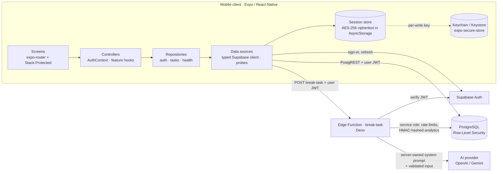
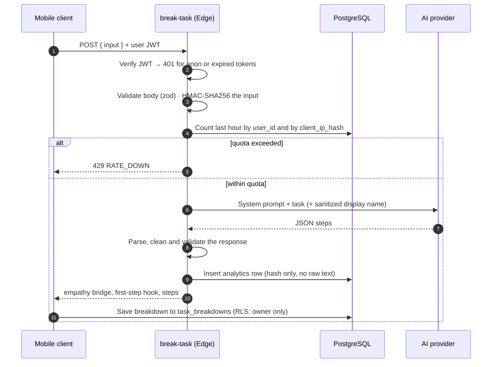

# Minito

**An ADHD-friendly task-initiation app that turns an overwhelming task into small, doable steps with AI, built on a hardened Supabase backend.**

Minito is a React Native (Expo) app backed by Supabase Auth, PostgreSQL with Row Level Security and a Deno Edge Function that calls OpenAI or Gemini. You type a task that feels too big; Minito answers with an empathy line, a laughably easy first action, and 3 to 7 atomic micro-steps, then walks you through them one at a time in a distraction-free focus mode.

This README focuses on the engineering: architecture, security posture and the trade-offs behind them.

---

## Highlights

- **Layered client architecture:** Data sources → repositories → controllers → UI, with typed error codes crossing each boundary.
- **Security-first backend:**
  - RLS on every user-facing table; internal tables locked to the service role.
  - Auth-required Edge Function with per-user and per-IP rate limits.
  - HMAC-hashed analytics.
  - Prompt-injection hardening on the one user-controlled field that reaches the system prompt.
- **Encrypted session storage:** AES-256 session encryption with the key held in the iOS Keychain or Android Keystore.
- **Graceful degradation everywhere:**
  - The app boots even without backend config.
  - Breakdowns fall back to localized offline steps.
  - History hides itself when its table is missing.
  - Outages surface as a quiet notice, not a crash.
- **Production tooling:**
  - Strict TypeScript, generated database types, ESLint and Prettier.
  - Jest tests, route-level error boundaries and Sentry.
  - A CI pipeline that type-checks the Deno functions and scans the full git history for secrets.
- **Complete EN/TR localization:** 243 keys at parity, no hardcoded UI strings, locale-aware dates.

---

## Architecture



### One breakdown, end to end



### Client layers

| Layer        | Location                                      | Responsibility                                                                                                          |
| ------------ | --------------------------------------------- | ----------------------------------------------------------------------------------------------------------------------- |
| UI           | `app/`, `src/features/*/ui`, `src/components` | Screens and presentational components; no direct Supabase access                                                        |
| Controllers  | `src/features/*/controller`                   | React state: `AuthContext`, `useTaskBreakdowns`, `useTaskProgressSync`, `useSystemHealth`                               |
| Repositories | `src/repositories`                            | Business rules and error mapping into typed codes such as `invalid_credentials`, `backend_unavailable` or `unavailable` |
| Data sources | `src/data`                                    | Supabase client, encrypted session storage, native Google/Apple ID-token providers, health probes                       |

Navigation is guarded at the root with Expo Router's `Stack.Protected`. The splash screen stays up until the persisted session is restored, so the guard never flashes the wrong screen.

---

## Security

### Row Level Security and a locked-down schema

| Table               | Access model                                                                                                                                             |
| ------------------- | -------------------------------------------------------------------------------------------------------------------------------------------------------- |
| `task_breakdowns`   | RLS with owner-only `SELECT/INSERT/UPDATE/DELETE` policies (`auth.uid() = user_id`); `user_id` defaults to `auth.uid()` and cascades on account deletion |
| `tasks` (analytics) | RLS enabled with **no** policies: unreadable and unwritable by app clients, reachable only by the Edge Function's service role                           |
| `system_prompts`    | Same lockdown, so the model's instructions can't be read or rewritten from the client                                                                    |
| `translations`      | Public read; the "any authenticated user can write" policy was dropped once sign-up became open                                                          |

The lockdown is verified from the outside: with the public anon key, `tasks` and `system_prompts` return zero rows (`supabase/migrations/007_lock_down_internal_tables.sql`).

### Encrypted session storage

Supabase sessions routinely exceed `expo-secure-store`'s ~2 KB value limit, so storing them there directly would silently break persistence. Minito uses the pattern Supabase recommends for Expo (`src/data/supabase/secureSessionStorage.ts`):

- **Fresh key per write:** Every write encrypts the session with a new AES-256 key.
- **Key location:** The key lives in the Keychain or Keystore via `expo-secure-store`.
- **Ciphertext location:** Only ciphertext is written to AsyncStorage.
- **Legacy sessions:** Plaintext sessions from before encryption are discarded on first read instead of being trusted.

### Edge Function hardening (`supabase/functions/break-task`)

- **Authenticated only:**
  - The bearer token must belong to a signed-in user.
  - Anon-key and expired tokens get `401` before any work happens.
- **Two-dimensional rate limiting:**
  - 20 requests per hour per verified `user_id`.
  - 40 per hour per client IP, so one address can't farm free accounts.
  - The IP is stored only as an HMAC.
- **Real HMAC-SHA256:**
  - Analytics store `HMAC-SHA256(input)` via Web Crypto, never the raw text.
  - `HMAC_SECRET` is mandatory; the function refuses to run without it instead of falling back to a default.
- **Type-checked:** No `@ts-nocheck`; every function passes `deno check` in CI.
- **No leaking internals:** 5xx responses return a generic message; details stay in the logs.

### Prompt-injection hardening

The user's display name is personalized into the prompt, which makes it the obvious injection vector:

1. **Read server-side:** The name is taken from the verified JWT's `user_metadata`, never from the request body.
2. **Sanitized:**
   - Control characters (`\p{Cc}`), quotes, backticks, braces and angle brackets are stripped.
   - Whitespace is collapsed and the name is capped at 30 characters.
3. **Embedded as data:** It is embedded via `JSON.stringify`, with an explicit instruction to treat it strictly as a name.

In addition:

- **Server-owned instructions:** The system prompt lives server-side and is locked by RLS.
- **Validated input:** The request body is schema-validated and capped at 1,000 characters.
- **Validated output:** Model output is parsed as strict JSON, cleaned and validated before it reaches the client.

### Privacy

- **Data export:** GDPR export (`export-user-data`) includes every saved breakdown.
- **Account deletion:** Deletion (`delete-user`) removes the account, and all owned rows cascade with it.
- **Monitoring:** Sentry tracks users by opaque id only; `sendDefaultPii` is off.

---

## Engineering decisions and trade-offs

**Why a silent fallback instead of an always-on system status?**
An observability panel is an engineering tool. For users of a calm, ADHD-focused app, a blinking status pill adds noise and quiet anxiety while telling them nothing they can act on. The client still probes the auth health endpoint and the AI gateway on every dashboard focus:

- **How the AI probe works:** It is an anon request that `break-task` rejects with `401` before doing any AI work, so it costs no budget.
- **What the user sees:** A warning card appears only when a service is actually down.
- **What stays hidden:** Slowness alone is never shown, because the user can't do anything about it.

**Why aren't raw task texts stored for analytics?**
Analytics only need counts, latency and deduplication, so the `tasks` table stores an HMAC of the input, not the text. The one place titles are stored is `task_breakdowns`, the user's own history:

- **Why it exists:** Users need it to resume a task on another device.
- **Who can see it:** Only the owner, enforced by RLS.
- **What users can do:** Export it, delete a row with a long press, or delete their account to erase it all.

**Why best-effort sync instead of an offline mutation queue?**
Progress updates during focus mode are fire-and-forget: a failed write is logged and dropped, never retried in the foreground. In an app meant to lower activation energy, a spinner or error in the middle of a step would do more harm than a slightly stale history. The trade-off is explicit: a durable offline queue is the natural next step if cross-device progress ever becomes critical. The same philosophy applies elsewhere:

- **Failed save:** A failed history save never blocks the user from starting the task.
- **Offline steps:** Offline fallback steps are never saved, because they're generic.

**Why does the app boot without backend configuration?**
A missing `EXPO_PUBLIC_SUPABASE_*` variable used to crash the app at import time. `getSupabase()` now throws a typed `BackendUnavailableError`:

- **Auth:** Repositories map it to `backend_unavailable`, so the app boots signed out and the login screen explains the situation instead of crashing.
- **History:** It maps to `unavailable`, so the history list hides itself.

**Why encrypt-then-AsyncStorage instead of SecureStore alone?**
SecureStore has a ~2 KB value limit and Supabase sessions routinely outgrow it. Keeping only the key in the keystore gives hardware-backed protection without that size ceiling. A known limitation is that AES-CTR has no integrity tag: it protects confidentiality, not tampering by someone who can already write the app's storage.

**Why do rate limits fail open?**
If the rate-limit query itself errors, the request is allowed rather than locking every user out during a database hiccup. The limits are a budget guard, not an authorization boundary; authorization is enforced separately by JWT verification.

**Why a members-only AI endpoint instead of guest access?**
Guest access would put the AI budget behind the public anon key, and IP-based limits alone are best-effort, since `x-forwarded-for` can be partially spoofed. Requiring a verified user makes every request attributable.

---

## Product polish

- **Complete localization:**
  - English and Turkish at full key parity: 243 keys, and every static `t()` key used in code resolves.
  - Dates use the active locale.
  - Offline fallback steps and planner sample suggestions are localized too.
- **Haptic vocabulary (`src/lib/ui/haptics.ts`):** One tactile language across the app; unsupported platforms fail silently.

  | Pattern     | Used for                                                    |
  | ----------- | ----------------------------------------------------------- |
  | `selection` | Scrolling, toggles, choices                                 |
  | `tap`       | Secondary taps such as back, dismiss or opening a sheet     |
  | `press`     | Primary actions such as submit or resume                    |
  | `commit`    | The one heavy impact, reserved for starting an AI breakdown |
  | `success`   | Completed steps and saved changes                           |
  | `warning`   | Destructive confirmations                                   |
  | `error`     | Failures                                                    |

- **Staged AI progress:**
  - "Analyzing, generating, finalizing" over shimmering skeleton rows.
  - The last stage holds until the server answers, so the UI never claims to be done early.
- **Honest UI:**
  - Unbuilt settings are shown as disabled "Coming soon" rows instead of switches that do nothing.
  - Keyword-based planner suggestions carry a **DEMO** badge.
- **Keyboard-safe forms:** A shared hook keeps the focused form above the keyboard under Android edge-to-edge.
- **Accessibility:** Roles, labels, selected and disabled states, and live regions on the core flows.
- **Consistent empty states:** One `EmptyState` component (icon, copy, call to action) across history, planner and insights.

---

## Tech stack

| Area              | Choices                                                                                  |
| ----------------- | ---------------------------------------------------------------------------------------- |
| App               | Expo SDK 54, React Native 0.81 (New Architecture), React 19, TypeScript (strict)         |
| Navigation and UI | Expo Router 6 (`Stack.Protected`), NativeWind, Reanimated 4, Lucide                      |
| Backend           | Supabase Auth, PostgreSQL with RLS, Edge Functions (Deno)                                |
| AI                | OpenAI `gpt-4o-mini` or Google Gemini, switchable via `AI_PROVIDER`                      |
| Security          | `expo-secure-store`, `aes-js`, `expo-crypto`, Web Crypto HMAC                            |
| Quality           | Jest (`jest-expo`), ESLint (`eslint-config-expo`), Prettier, generated DB types          |
| Observability     | Sentry (release and environment tags, opaque user id), route-level error boundaries      |
| CI                | GitHub Actions: typecheck, lint, format, tests, `deno check`, gitleaks full-history scan |

---

## Getting started

**Prerequisites:** Node 20+, a Supabase project, and an OpenAI or Gemini API key. Google sign-in needs a development build; email sign-in works in Expo Go.

```bash
npm install
# create a .env file in the project root with the variables below
npm start
```

**App environment (`.env`)**

| Variable                            | Required | Purpose                                                   |
| ----------------------------------- | -------- | --------------------------------------------------------- |
| `EXPO_PUBLIC_SUPABASE_URL`          | Yes      | Supabase project URL                                      |
| `EXPO_PUBLIC_SUPABASE_ANON_KEY`     | Yes      | Public anon key; all data access is still governed by RLS |
| `EXPO_PUBLIC_SENTRY_DSN`            | No       | Enables Sentry; monitoring is a no-op without it          |
| `EXPO_PUBLIC_GOOGLE_WEB_CLIENT_ID`  | No       | Shows Google sign-in                                      |
| `EXPO_PUBLIC_APPLE_SIGN_IN_ENABLED` | No       | `true` shows Sign in with Apple on iOS                    |

**Backend**

1. Apply the SQL files in `supabase/migrations` in order.
2. Set the function secrets:
   - `supabase secrets set HMAC_SECRET=$(openssl rand -hex 32)` (required)
   - `AI_PROVIDER` (`openai` or `gemini`)
   - `OPENAI_API_KEY` and/or `GEMINI_API_KEY`
3. Deploy the functions: `npx supabase functions deploy break-task` (and `delete-user`, `export-user-data`).
4. Regenerate client types after any schema change: `npm run gen:types`.

More detail: [`docs/SUPABASE_SETUP.md`](./docs/SUPABASE_SETUP.md), [`docs/OAUTH_SETUP.md`](./docs/OAUTH_SETUP.md), [`supabase/functions/break-task/README.md`](./supabase/functions/break-task/README.md). A Turkish setup guide lives in [`docs/SUPABASE_KURULUM_REHBERI.md`](./docs/SUPABASE_KURULUM_REHBERI.md).

**Scripts**

| Command                           | What it does                                                    |
| --------------------------------- | --------------------------------------------------------------- |
| `npm run typecheck`               | `tsc --noEmit` in strict mode                                   |
| `npm run lint`                    | ESLint                                                          |
| `npm run format` / `format:check` | Prettier                                                        |
| `npm test`                        | Jest suite for the repository layer                             |
| `npm run gen:types`               | Regenerate `database.types.ts` from the linked Supabase project |

---

## Project structure

```
app/                     Expo Router screens; every route exports an ErrorBoundary
src/
  data/                  Supabase client, encrypted session storage, auth providers, health probes
  repositories/          auth, tasks and health repositories (+ __tests__)
  features/
    auth/                AuthContext, DisplayNameEditor
    tasks/               breakdown history, progress sync, staged progress UI
    health/              health checks and the silent outage notice
  components/            shared UI (EmptyState, RouteErrorBoundary, TaskInput, …)
  lib/                   i18n (EN/TR), Sentry, haptics, keyboard handling, offline fallback
supabase/
  functions/             break-task, delete-user, export-user-data (Deno)
  migrations/            schema, RLS policies and the security lockdown (001–010)
.github/workflows/ci.yml typecheck · lint · format · test · deno check · gitleaks
```

---

## Known limitations and next steps

- **iOS:** Not yet configured for release (`bundleIdentifier` and Apple sign-in entitlements).
- **Moderation:** Runs only when an OpenAI key is present; with Gemini it is skipped and logged.
- **Planner:** Projects and focus insights are stored on-device only; breakdown history is the synced source of truth.
- **Rate limiting:** Fails open on database errors, and client IPs are best-effort.
- **Session encryption:** AES-CTR provides confidentiality without an integrity tag.
- **Deprecated dependency:** `expo-av` should migrate to `expo-audio`.
- **Offline progress:** A durable offline mutation queue would make progress sync fully offline-first.
