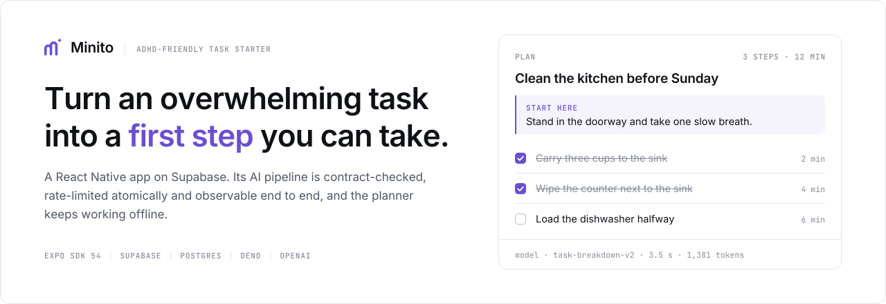
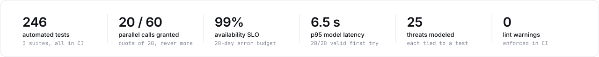
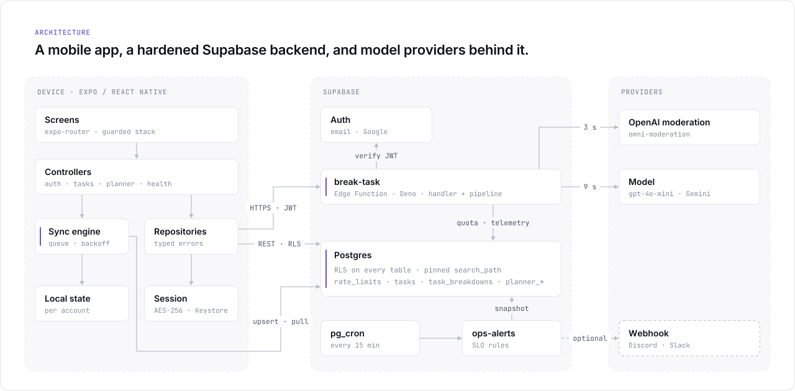
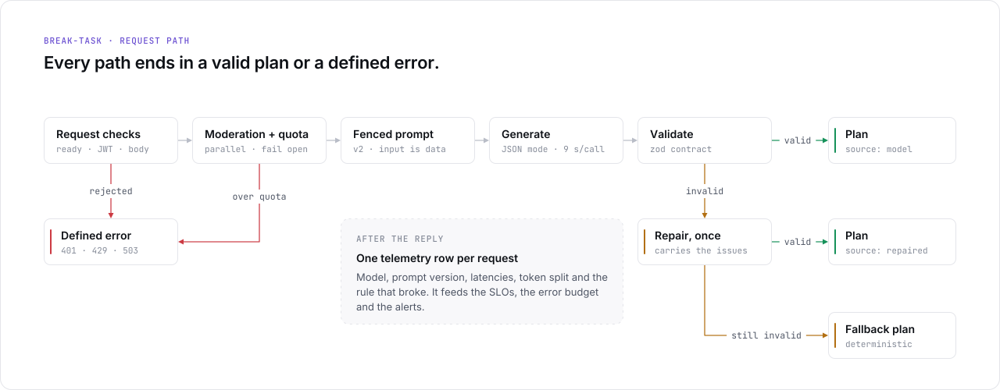
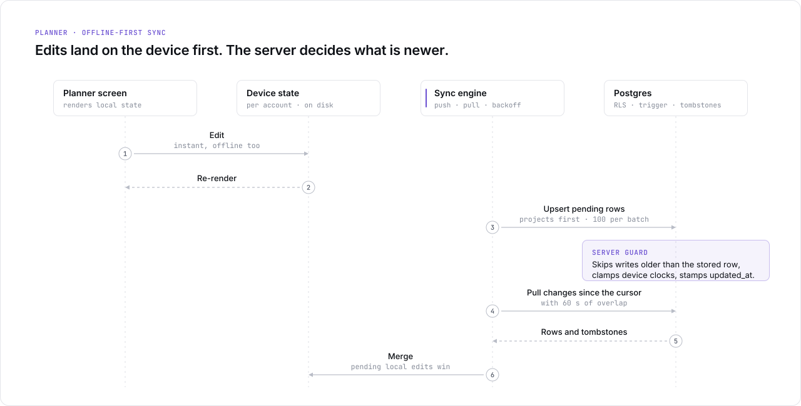

<p align="center">
  <picture>
    <source media="(prefers-color-scheme: dark)" srcset="docs/assets/hero-en-dark.svg">
    
  </picture>
</p>

<p align="center"><b>Turn a task that feels too big into one laughably easy first step.</b></p>

<p align="center">
  Minito is an offline-first React Native app on a hardened Supabase backend,
  with an AI pipeline that is fenced, validated and measured.
</p>

<p align="center">
  <a href="https://github.com/ahmetHakanSenel/Minito/actions/workflows/ci.yml"></a>
  
  
  
  
</p>

<p align="center"><b>English</b> · <a href="docs/README.tr.md">Türkçe</a></p>

## What it does

You type something that feels too big — "clean the kitchen before Sunday" — and Minito answers
with three things: a line that shows it understood, a first action that takes seconds, and three
to seven atomic steps shown one at a time in a calm focus mode, each with an honest time estimate
and explicit permission to stop.

History, progress and the project planner sync across devices, and keep working offline.

<!--
  Product screenshots go here, once they have been captured from a device. Drop the files in
  docs/assets/ and uncomment:

<p align="center">
  
</p>
-->

<p align="center">
  <picture>
    <source media="(prefers-color-scheme: dark)" srcset="docs/assets/numbers-en-dark.svg">
    
  </picture>
</p>

> **What these numbers are.** The left group is produced by the test suites on every push. The
> right group comes from a committed offline evaluation over 20 tasks, run against the real
> pipeline. The service-level objectives further down are targets defined for a production
> workload, not measurements of one. This repository has never served production traffic.

The rest of this README is about the engineering: how the system fails safely, how every claim is
tested, and how it would be operated.

## For reviewers: where to look

| Claim | Evidence |
| ----- | -------- |
| **Concurrent requests cannot exceed the configured quota**, and cycling accounts does not reset it | [`014_atomic_rate_limits.sql`](supabase/migrations/014_atomic_rate_limits.sql). The database suite fires 60 parallel calls at a quota of 20 and gets exactly 20 grants |
| **The model is untrusted in both directions** | [`pipeline.ts`](supabase/functions/break-task/pipeline.ts): a data fence that tags cannot break, a zod contract, one repair, a deterministic fallback |
| **Every request-path rule is tested without a network** | [`handler.ts`](supabase/functions/break-task/handler.ts) takes its side effects as dependencies; [`handler.test.ts`](supabase/functions/break-task/handler.test.ts) covers auth, ordering, fail-open and error paths |
| **Offline-first sync that survives stale devices** | [`syncEngine.ts`](src/features/planner/syncEngine.ts) and [`016_planner_sync.sql`](supabase/migrations/016_planner_sync.sql): idempotent pushes, tombstones, a server-side guard against stale writes |
| **RLS and grants are verified, not assumed** | Migrations run on real Postgres with Supabase's default grants reproduced ([`bootstrap.sql`](supabase/tests/bootstrap.sql)). Schema-wide checks fail on any table without RLS or any function without a pinned `search_path` |
| **The system is operable** | [`RUNBOOK.md`](docs/RUNBOOK.md): SLOs, an error budget, log events, alert rules, playbooks, expand/contract deploys. The SQL behind it runs in CI |
| **Security is reasoned about** | [`THREAT_MODEL.md`](docs/THREAT_MODEL.md): 25 threats, each mapped to its control and to the test that proves it, plus accepted risks with revisit triggers |
| **Prompt changes are judged by measurement** | [`scripts/eval.ts`](scripts/eval.ts) and a committed [baseline](docs/eval/README.md#baseline) |

---

## Architecture

<p align="center">
  <picture>
    <source media="(prefers-color-scheme: dark)" srcset="docs/assets/architecture-en-dark.svg">
    
  </picture>
</p>

- **App layers.** Data sources, repositories, controllers and UI each have their own job. Typed
  errors cross every boundary, so a missing backend shows up as an explanation on the login
  screen, not as a crash at import time.
- **Planner.** Screens render only local state, so the planner works offline and never shows a
  spinner.

---

## The AI pipeline

<p align="center">
  <picture>
    <source media="(prefers-color-scheme: dark)" srcset="docs/assets/pipeline-en-dark.svg">
    
  </picture>
</p>

| Stage | What happens |
| ----- | ------------ |
| **Gatekeeping** | Readiness is checked first (`503`), so the anonymous health probe sees a misconfigured deployment. Then the JWT (`401`), then the body: read no further than 16 KB (`413`), and validated with the task trimmed before its length is checked (`400`) |
| **Moderation and quota** | They run in parallel. Safety outranks quota. Only self-harm is answered with crisis support; anything else moderation flags is refused plainly. The user quota is checked before the IP quota, so a request refused for its account never spends a shared, partly caller-supplied IP budget. Both fail open, and every failure is logged |
| **Fence** | Every `<` and `>` in user text becomes `‹ ›`. Stripping tag names is not enough: removing them once can assemble a new tag (`</task_</task_input>input>`) |
| **Generate** | Provider JSON mode, 9 s per call, and one retry on network errors or 5xx. A `429` is never retried |
| **Validate and repair** | A zod contract: 3–7 steps, a first step that is `easy`, 1–10 minutes each. A failing reply gets exactly one repair. The issues are rewritten so they never quote model output into logs |
| **Fallback** | A deterministic plan, validated at module load. A broken fallback fails the deploy, not a user |

**Which language a plan comes back in.** The task decides: someone writing in English inside a
Turkish app gets an English plan. When the task is too short to tell — "kargo", "taxes" — the
language the app is running in decides, because the client knows it for certain and the server
would otherwise be guessing from a handful of characters. It used to guess English, which is how
a Turkish task with no Turkish letters in it came back in English.

Every answered request writes one telemetry row after the reply: the model and prompt version,
model and end-to-end latency, the token split including cached tokens, the finish reason, the
contract rule that broke if any, and whether the answer came back in the language it was asked
for.

Users can rate a plan with one tap. The rating goes through a `SECURITY DEFINER` function that
writes only to the caller's own row.

**Offline evaluation.** A fixed set of 20 Turkish and English tasks runs through the real pipeline,
so a prompt or model change is judged by measurement rather than by impression. The committed
`gpt-4o-mini` baseline: 20/20 valid on the first try, 20/20 in the right language, model latency
p50 3.5 s and p95 6.5 s, under one cent for the whole run. Twenty tasks is a smoke test, not a
benchmark — it is there to catch a regression, and it is small enough to say so.

---

## Reliability and operations

Every dependency has a defined failure mode. The rule behind them: for someone who is struggling
to start, a calm generic plan now beats an error message.

| When this fails | The system | The user sees |
| --------------- | ---------- | ------------- |
| Model provider | Retries once, then `503 AI_DOWN` within a 17 s budget | Offline steps and a quiet notice |
| Model output | One repair, then the deterministic plan | A generic but usable plan |
| Moderation | Fails open after 3 s and logs it | Nothing |
| Quota check | Fails open and logs an error; the provider spend limit is the backstop | Nothing |
| Supabase Auth | Answers `503`, never `401` | Offline steps; **nobody is signed out** |
| Telemetry write | Retries after the reply; the insert is idempotent | Nothing |
| Network, for the planner | Edits queue on the device and retry with backoff | Nothing; the planner stays usable |

**Service-level objectives, over 28 days.** These are targets defined for a production workload.
No production traffic has been served, so nothing below is a measurement:

- **Availability:** 99% of eligible requests are answered with a plan.
- **Latency:** 95% of plans arrive within 12 s.
- **Model response rate:** 97% of plans come from the model rather than the fallback. This counts
  where a plan came from, not how good it was; plan quality is measured separately and offline.

What is real is the machinery that would evaluate them: the SLI queries run in CI against a real
Postgres, and the alert rules are unit-tested.

**Alerting.** `ops-alerts` evaluates availability, model response rate, latency, the error budget
and spend every 15 minutes, with three properties:

- **No noise at low traffic.** Each rule needs a minimum sample before it can fire.
- **Notifications on change.** A person hears about a rule when it fires, every 6 hours while it
  keeps firing, and when it resolves.
- **Off by default.** Nothing is sent until a webhook is configured.

The [runbook](docs/RUNBOOK.md) has the rationale for each target, the log event catalogue and a
playbook for every row above.

---

## Offline-first planner sync

<p align="center">
  <picture>
    <source media="(prefers-color-scheme: dark)" srcset="docs/assets/sync-en-dark.svg">
    
  </picture>
</p>

| Guarantee | How |
| --------- | --- |
| A retried push never duplicates | Ids are generated on the device, so a retry is an upsert of the same row |
| Deletes reach offline devices | Deletes are tombstones, purged after 30 days. A device away for longer than three weeks rebuilds from the server's whole state instead of pulling recent changes, so it cannot miss a delete whose tombstone is already gone |
| A stale device cannot overwrite newer edits | A trigger compares `client_updated_at` and skips older writes. Far-future clocks are clamped |
| An edit made during a push is not lost | Each pending change is versioned, and a push clears only the version it sent |
| One bad row cannot block the queue | A rejected batch is retried row by row, and permanent failures are isolated |
| No missed rows at page or commit boundaries | The pull overlaps the cursor, and merging is idempotent |
| Tasks stay with their owner | A composite foreign key `(project_id, user_id)` sits on top of RLS |

---

## Security

The client is untrusted. The model's output is untrusted. Privileged database functions are
scoped explicitly rather than by default. Every claim below is backed by a test, and the full
analysis is in [`THREAT_MODEL.md`](docs/THREAT_MODEL.md).

- **Least privilege in the database.**
  - RLS is on every table, and every function pins its `search_path`.
  - Privileged functions are revoked from `anon` and `authenticated` explicitly. Supabase grants
    both by default, and a test proves the revoke matters.
- **Authenticated AI only.**
  - Quotas are atomic, and they are not tied to accounts, so deleting and re-creating an account
    does not reset them.
- **No text at rest where it is not needed.**
  - The request log keeps an HMAC of each task, never its text. The text itself is stored only
    where the person needs it back — their own history and planner — behind RLS that limits every
    row to its owner, and it goes with the account.
  - Logs carry ids, counts and durations.
  - An IP is kept only as an HMAC inside a quota counter. Unused personal data (IP columns,
    guest ids) was removed from the schema.
- **Authenticated, crash-safe session storage.**
  - XChaCha20-Poly1305 (AEAD) with a fresh key and nonce per write; the key stays in the
    Keychain or Keystore.
  - The ciphertext is bound to its storage slot and key id. A flipped bit, a truncated blob or a
    blob moved elsewhere fails to decrypt, and the user signs in again instead.
  - Writes are ordered so a crash at any step leaves a readable session, and a process lock
    serializes token refreshes.
- **Replay-resistant Apple sign-in.**
  - Each attempt uses a fresh 256-bit nonce. Apple receives only its SHA-256, and Supabase checks
    the raw value against the token, so a captured token cannot be replayed.
- **Privacy rights.**
  - Export covers the account, the history, the planner and the AI request log.
  - Deleting the account removes the server data by cascade and the device copy too.
  - Telemetry expires after 90 days.

---

## Testing

| Suite | Tests | What it proves |
| ----- | ----: | -------------- |
| App (Jest) | 241 | The planner model, sync engine and scheduler; the API client's degradation per status; session storage that rejects tampering and survives crashes; the Apple nonce; the duration wheel, pickup detection and audio fade arithmetic; locale parity, including every static `t()` key |
| Edge functions (Deno) | 97 | Request-path ordering and failure rules, the AI contract and repair, which language a plan comes back in, provider timeouts and retries, moderation fail-open, Auth outage handling, alert rules and notification transitions |
| Database (Postgres) | 36 | Cross-user RLS, grants under Supabase's defaults, quota concurrency, cascades, planner sync guards, schema-wide invariants, the runbook's SQL |
| Schema drift | | The committed TypeScript types equal what the migrations produce |
| Secrets | | gitleaks over the full git history |

To check that the database suite catches real mistakes, five faults were introduced by hand. Each
one made it fail:

- A missing `REVOKE`.
- A quota that counts first and writes later.
- A function without a pinned `search_path`.
- No stale-write guard on planner rows.
- A plain foreign key instead of the composite one.

<details>
<summary><b>Engineering decisions and trade-offs</b></summary>

**Why an atomic SQL function for rate limiting?** The first version counted telemetry rows, which
were written only after the AI call. Parallel requests could not see each other, and the rows
cascaded away with the account. One `INSERT … ON CONFLICT DO UPDATE` removes the race, and a
table with no link to users removes the reset. A fixed window can let twice the limit through at a
boundary; for a budget guard, that is worth one row and one statement per caller.

**Why does the handler take its dependencies as an argument?** It makes the ordering rules
testable: safety before quota, the user's quota before the IP's, readiness before auth. Those are
the rules that matter most and break most easily in a refactor.

**Why is the user quota checked before the IP quota?** Each check spends a unit as it passes, so
the first one is spent even when the second refuses. The IP bucket is shared by everyone behind
an address, and the address is partly caller-supplied. Checked first, it could be emptied for free
by an account that had already used up its own quota and kept naming someone else's address.
Checked second, it is only ever spent by requests that will be served.

**Why do quota and moderation fail open?** A database hiccup should not lock out someone who is
already struggling to start. Each failure is logged at a level that can page, and the provider's
spend limit is the hard ceiling.

**Why answer `503` when Auth is down?** The app treats `401` as "your session is gone". A `401`
during an Auth outage would sign out every active user at once.

**Why tombstones and last-write-wins for the planner?** A planner row is a title or a checkbox;
merging fields would add complexity without value. Tombstones plus a server-side guard against
stale writes give correct deletes and ordering with no coordination between devices.

**Why expand/contract migrations?** Migration 015 drops columns that the previous function
version still writes. Shipping add → deploy → remove keeps every step compatible with the code
running at that moment.

**Why alerts with minimum samples?** At three requests, one failure reads as 67% availability. An
alert that cries wolf teaches people to ignore alerts.

**Why no always-on status indicator?** For this audience, a blinking status pill is noise. The app
probes quietly and speaks only when something is down.

**Why does the duration wheel not model its own momentum?** It used to: a spring settle, a
hand-rolled fling target, an endless strip translated on the UI thread. Every platform gesture it
reimplemented was one more thing to get subtly wrong on a device it had not been tuned on. It is
now a snapping scroll view, which costs nothing visually and ages with the OS instead of against
it.

</details>

## What this does not claim

These are the gaps a reviewer would find anyway, so they are written down here.

- **No production traffic.** The SLOs, the error budget and the alert thresholds are design
  targets. The queries and rules behind them are tested; the workload they describe is
  hypothetical.
- **The AI evaluation set is 20 tasks.** Enough to catch a regression between prompt versions,
  not enough to characterise model quality.
- **Android has been exercised on a device. iOS has not.** The iOS configuration exists (bundle
  identifier, Sign in with Apple) and the project builds, but no iOS device run has happened.
- **Log-based alerts** (such as `quota_check_failed`) rely on the platform's log explorer. The
  scheduled rules cover only what the database records.
- **Quota and moderation fail open** by design, so an outage in either leaves the provider's spend
  limit as the hard ceiling. A fixed window can also let up to twice the limit through at a window
  boundary.
- **Planner conflicts** resolve by last write per row, not by merging fields. After a deletion's
  tombstone has been purged, the evidence of the delete is gone, so an edit made offline to that
  row before the device reconciles brings it back.
- **Retention depends on scheduled jobs.** Telemetry expiry, quota counter cleanup and tombstone
  purging are `pg_cron` jobs listed in the runbook. A deployment without them keeps that data.

The last three are deliberate. Each is recorded in the
[threat model](docs/THREAT_MODEL.md#accepted-risks) with the condition that would change it.

---

## Tech stack

| Area | Choices |
| ---- | ------- |
| App | Expo SDK 57, React Native 0.86, React 19.2, TypeScript 6 (strict), Expo Router 6, Reanimated 4, Skia, expo-audio |
| Backend | Supabase Auth, Postgres (RLS, `pg_cron`, `pg_net`), Deno Edge Functions |
| Security | XChaCha20-Poly1305 via `@noble/ciphers`, Keychain/Keystore via `expo-secure-store`, HMAC-SHA256, nonce-bound Apple sign-in |
| AI | OpenAI `gpt-4o-mini` or Gemini, switchable by secret; OpenAI moderation |
| Quality | Jest, Deno test, `node:test` on Postgres, ESLint (zero warnings), Prettier |
| Operations | Structured JSON logs, SQL SLIs and error budget, `ops-alerts`, Sentry (opaque ids only) |
| CI | GitHub Actions: app, edge functions, database with type drift, gitleaks; Dependabot |

<details>
<summary><b>Project structure</b></summary>

```
app/                              Expo Router screens; each exports an error boundary
src/
  data/                           Supabase client, encrypted session storage, auth providers
  repositories/                   auth, tasks, feedback, health
  features/planner/               offline-first sync: model, engine, scheduler, storage, remote
  features/                       auth, tasks, health, settings
  context/                        audio (expo-audio) and the planner provider
  lib/                            API client, i18n (EN/TR), haptics, monitoring
supabase/
  functions/_shared/              HTTP and auth helpers
  functions/break-task/           handler, pipeline, providers, moderation
  functions/ops-alerts/           SLO rules and notification transitions
  functions/delete-user/          right to erasure
  functions/export-user-data/     right of access
  migrations/                     001–018
  tests/                          database suite and the Supabase bootstrap
scripts/                          evaluation harness, brand and README artwork
docs/                             RUNBOOK, THREAT_MODEL, ops SQL, evaluation set and baseline
```

</details>
