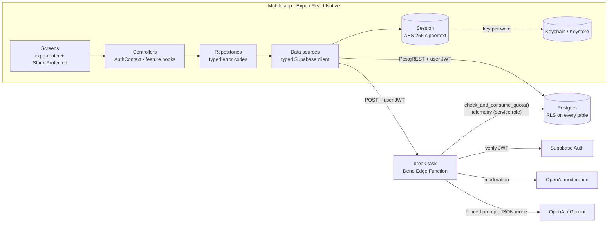
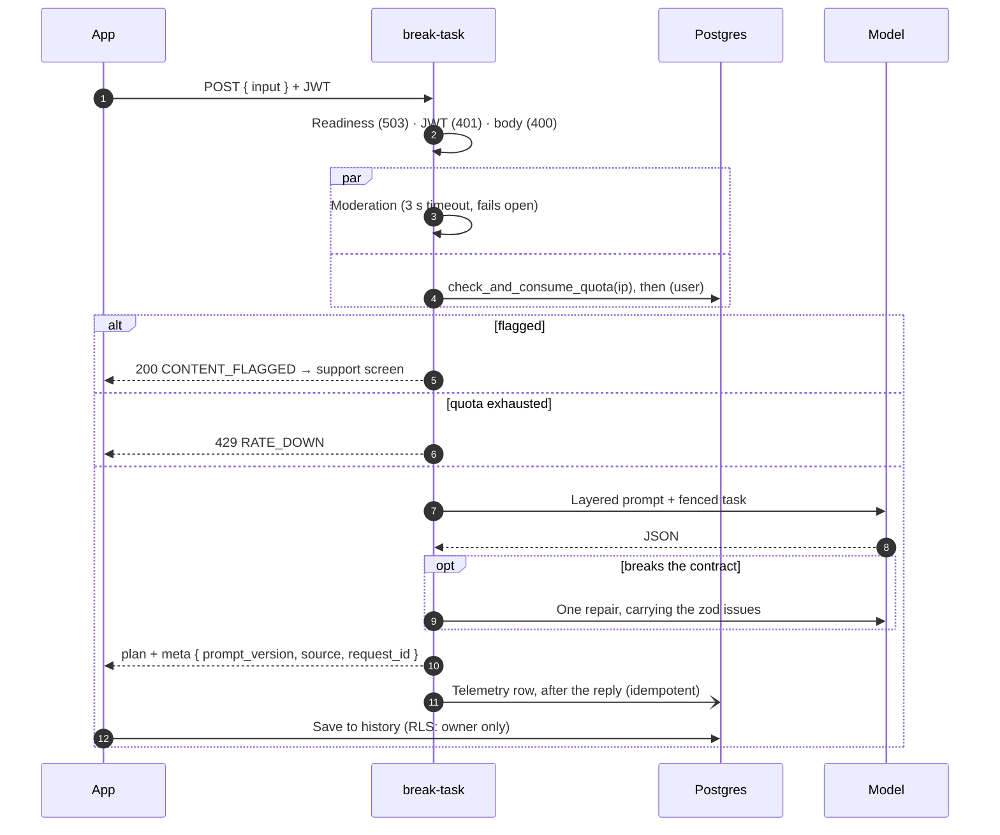

# Minito

[](https://github.com/ahmetHakanSenel/Minito/actions/workflows/ci.yml)

**An ADHD-friendly task-starter: type a task that feels too big, get a laughably easy first action
and 3–7 atomic steps, then work through them one at a time.**

Minito is a React Native (Expo) app on Supabase: Auth, Postgres with Row Level Security, and Deno
Edge Functions that call OpenAI or Gemini. This README is about the engineering: how the system
fails safely, how its claims are tested, and the trade-offs behind it.

---

## For reviewers: where to look

| Claim | Evidence |
| ----- | -------- |
| The AI budget cannot be drained by concurrency or by cycling accounts | [`014_atomic_rate_limits.sql`](supabase/migrations/014_atomic_rate_limits.sql). [`database.test.mjs`](supabase/tests/database.test.mjs) fires 60 concurrent calls at a limit of 20 and gets exactly 20 grants |
| The model is untrusted in both directions | [`pipeline.ts`](supabase/functions/break-task/pipeline.ts): a fence that tags cannot break, a zod contract, one repair, a deterministic fallback |
| Every request-path rule is tested without a network | [`handler.ts`](supabase/functions/break-task/handler.ts) takes its side effects as dependencies; [`handler.test.ts`](supabase/functions/break-task/handler.test.ts) covers auth, ordering, fail-open and error paths |
| RLS and grants are verified, not assumed | Migrations run on a real Postgres that reproduces Supabase's default grants ([`bootstrap.sql`](supabase/tests/bootstrap.sql)). Schema-wide checks catch any table without RLS and any function without a pinned `search_path` |
| The system is operable | [`RUNBOOK.md`](docs/RUNBOOK.md): SLOs with an error budget, a catalogue of log events, alerts, playbooks, expand/contract deploys. Its SQL ([`telemetry-queries.sql`](docs/ops/telemetry-queries.sql)) runs in CI |
| Security is reasoned about | [`THREAT_MODEL.md`](docs/THREAT_MODEL.md): 19 threats, each mapped to its control and the test that proves it, plus accepted risks with revisit triggers |
| Prompt changes are judged by measurement | [`scripts/eval.ts`](scripts/eval.ts) and a committed [baseline](docs/eval/README.md#baseline) |

**169 automated tests**, all run by CI on every push:

- 83 Jest tests for the app.
- 61 Deno tests for the edge functions.
- 25 database tests against Postgres.

CI also runs a type-drift check against the migrations and a gitleaks scan of the full history.

---

## Architecture



The app is layered: data sources → repositories → controllers → UI. Typed error codes cross each
boundary, so a missing backend becomes `backend_unavailable` on the login screen, not a crash at
import time.

### One breakdown, end to end



---

## Reliability

Every dependency has a defined failure mode, chosen for someone who is struggling to start: a
calm, generic plan now beats an error message.

| When this fails | The system | The user sees |
| --------------- | ---------- | ------------- |
| Model provider | Retries once, then `503 AI_DOWN` inside a 17 s budget | Offline steps and a quiet notice |
| Model output | One repair, then a deterministic plan that is itself schema-checked at load | A generic but usable plan |
| Moderation | Fails open after 3 s and logs it | Nothing |
| Quota check | Fails open and logs an error; the provider spend limit is the backstop | Nothing |
| Supabase Auth | Answers `503`, never `401` | Offline steps; **nobody is signed out** |
| Telemetry write | Retries after the reply; the insert is idempotent | Nothing |
| No backend config | Boots signed out, with typed "unavailable" errors | An explanation on the login screen |

SLOs, measured from the telemetry table over 28 days:

| SLI | SLO |
| --- | --- |
| Availability | 99% of eligible requests answered with a plan |
| Latency | 95% answered within 12 s |
| Quality | 97% of plans come from the model, not the fallback |

The [runbook](docs/RUNBOOK.md) explains how each target was chosen, tracks the error budget, and
has alerts and playbooks for each failure above.

---

## AI pipeline

`break-task` returns a typed plan, never free text.

| Stage | What happens |
| ----- | ------------ |
| Prompt | Five layers (identity, rules, tone, decomposition, output contract), versioned as `PROMPT_VERSION` |
| Fence | The task and display name are wrapped in tags. Every `<` and `>` inside them becomes `‹ ›`, so no tag can be opened or closed, however it is nested or spaced |
| Generate | Provider JSON mode. Each call has a 9 s timeout; one retry is allowed on network errors and 5xx, never on `429` |
| Validate | zod: 3–7 steps with unique ids, a first step that is `easy`, 1–10 minutes each, length caps on every string |
| Repair | Exactly one follow-up request carrying the issues. Issues are rewritten so they never quote the model's output, because they are logged |
| Fallback | A deterministic plan in the task's language. It is validated at module load, so a broken fallback fails the deploy, not a user |

Every request writes one telemetry row: model, prompt version, model time and end-to-end time,
token split (including cached prompt tokens), finish reason, the contract rule that broke, and
whether the answer matched the task's language. `language_match` stays null when a one-word task
gives no language evidence, so a guess is never scored as a mismatch.

Users can rate a finished plan with one tap. The score goes through
`submit_breakdown_feedback()`, which can only write a valid score, only on the caller's own row.

**Offline evaluation.** `npm run eval:ai` runs 20 fixed tasks (Turkish and English, including a
single word and a question) through the real pipeline. The committed `gpt-4o-mini` baseline:

- 20/20 valid on the first try, 20/20 in the right language.
- Model time: p50 3.5 s, p95 6.5 s.
- Cost: under one cent for the whole run.

`--dry-run` exercises every outcome with a fake provider, and CI runs it.

---

## Security

The full analysis is in [`THREAT_MODEL.md`](docs/THREAT_MODEL.md). The essentials:

- **Least privilege in the database.**
  - RLS is on every table.
  - `task_breakdowns` is owner-only.
  - `tasks` (telemetry) and `rate_limits` have no client policies at all.
  - Privileged functions run with an empty `search_path`, and are revoked from `anon` and
    `authenticated` explicitly: Supabase grants both by default, so revoking from `PUBLIC` alone
    would not be enough.
- **Authenticated AI only.**
  - The anon key gets `401` before any work is done.
  - Quotas are 40/h per IP, then 20/h per user, enforced atomically.
  - Counters are not tied to accounts, so deleting and re-creating an account does not reset them.
- **No text at rest where it is not needed.**
  - The task text is stored only as an HMAC.
  - Logs carry ids, counts and durations.
  - IP hashes and guest ids were dropped from the schema once nothing needed them.
- **Encrypted sessions.**
  - AES-256 with a fresh key per write; the key lives in the Keychain or Keystore.
  - Writes are ordered so that a crash at any step leaves a readable session.
  - The Supabase client's process lock serializes token refreshes.
- **Privacy rights.**
  - `export-user-data` returns the account, the saved history and the AI request log.
  - `delete-user` removes the account; every owned row cascades.
  - Telemetry expires after 90 days.

---

## Testing

| Layer | Tool | What it proves |
| ----- | ---- | -------------- |
| App | Jest (`jest-expo`) | Repositories map errors to typed codes. The API client degrades correctly for each status. Session storage survives a crash at each step. Every static translation key exists in both languages, with matching placeholders |
| Edge functions | `deno test` | The request path's ordering and failure rules, the pipeline's contract and repair, provider timeouts and retries, moderation fail-open, auth outage handling |
| Database | `node:test` + Postgres | Migrations apply cleanly. RLS holds across users. Grants are correct under Supabase's defaults. Quotas hold under 60 concurrent calls. Cascades work. Schema-wide invariants hold. The runbook's queries run |
| Schema drift | Supabase CLI | The committed TypeScript types equal what the migrations produce |
| Secrets | gitleaks | The full history, on every push |

To check that the database suite catches real mistakes, three faults were introduced by hand
and each one made the suite fail:

- A missing `REVOKE`.
- A count-then-write quota.
- A function without a pinned `search_path`.

---

## Engineering decisions

**Why an atomic SQL function for rate limiting?** The first version counted telemetry rows. Those
rows were written after the AI call finished, so parallel requests could not see each other, and
they cascaded away with the account. One `INSERT … ON CONFLICT DO UPDATE` removes the race, and a
table with no user link removes the reset. A fixed window can let up to twice the limit through
at a boundary; for a budget guard that is worth one row and one statement per caller.

**Why does the handler take its dependencies as an argument?** It makes the ordering rules
testable: safety before quota, IP before user, readiness before auth. Those rules are the ones
that matter most and are easiest to break in a refactor.

**Why do quota and moderation fail open?** A database or safety-service hiccup should not lock out
someone who is already struggling to start. Each failure is logged at a level that can page, and
the provider account's spend limit is the hard ceiling. The trade-off is written down in the
threat model, together with when to revisit it.

**Why answer `503` when Auth is down?** The app treats `401` as "your session is gone" and signs the
user out. Answering `401` during an Auth outage would sign out every active user at once.

**Why one repair, then a deterministic plan?** A model that misses the contract usually misses it
narrowly, and one repair that carries the exact issues fixes that cheaply. Further rounds mostly
burn latency on a model that is already confused.

**Why expand/contract migrations?** Migration 015 drops columns that the previous function version
still writes. Shipping add → deploy → remove keeps every step compatible with the code running at
that moment.

**Why best-effort progress sync instead of an offline queue?** A spinner in the middle of a step
does more harm than slightly stale history. A durable queue is the natural next step if
cross-device progress ever becomes critical.

**Why no always-on status indicator?** For this audience, a blinking status pill is noise. The app
probes quietly and shows a notice only when something is actually down.

---

## Tech stack

| Area | Choices |
| ---- | ------- |
| App | Expo SDK 54, React Native 0.81 (New Architecture), React 19, TypeScript (strict) |
| UI | Expo Router 6 (`Stack.Protected`), NativeWind, Reanimated 4, Skia |
| Backend | Supabase Auth, Postgres (RLS), Edge Functions (Deno) |
| AI | OpenAI `gpt-4o-mini` or Gemini, switchable by secret; OpenAI moderation |
| Quality | Jest, Deno test, `node:test` + Postgres, ESLint (zero warnings), Prettier |
| Operations | Structured JSON logs, SQL telemetry and SLO queries, Sentry (opaque user ids only) |
| CI | GitHub Actions: app, edge functions, database with type drift, gitleaks; Dependabot |

---

## Getting started

```bash
npm install
cp .env.example .env    # Supabase URL and anon key
npm start
```

The app boots without a backend, in a signed-out offline mode. Backend setup, sign-in providers,
scheduled jobs and the checks to run are in [`docs/SETUP.md`](docs/SETUP.md) (Turkish:
[`docs/SETUP.tr.md`](docs/SETUP.tr.md)).

| Command | What it does |
| ------- | ------------ |
| `npm test` | Jest |
| `npm run test:edge` | Deno tests for the edge functions |
| `npm run test:db` | Database tests (needs a local Postgres; see setup) |
| `npm run typecheck` · `lint` · `format:check` | Static checks |
| `npm run gen:types` | Regenerates the database types from the migrations |
| `npm run eval:ai` | Offline evaluation of the AI pipeline |

---

## Project structure

```
app/                         Expo Router screens; each exports an error boundary
src/
  data/                      Supabase client, encrypted session storage, auth providers, probes
  repositories/              auth, tasks, feedback, health (+ tests)
  features/                  auth, tasks, health, settings: controllers and UI
  components/  modals/       shared UI
  lib/                       API client, i18n (EN/TR), haptics, monitoring, time
supabase/
  functions/_shared/         HTTP and auth helpers shared by all functions
  functions/break-task/      handler, pipeline, providers, moderation (+ tests)
  functions/delete-user/     right to erasure
  functions/export-user-data/ right of access
  migrations/                001–015: schema, RLS, atomic quotas, hardening
  tests/                     database test suite and the Supabase bootstrap
scripts/eval.ts              offline evaluation harness
docs/
  SETUP.md  RUNBOOK.md  THREAT_MODEL.md
  ops/telemetry-queries.sql  SLI, error budget, cost and quality queries
  eval/                      evaluation task set and baseline results
```

---

## Known limitations and next steps

- **iOS** is not configured for release yet (bundle identifier, Apple sign-in entitlements, and a
  nonce for Apple ID tokens).
- **Planner projects and focus insights** are stored on the device only. The breakdown history is
  the synced source of truth.
- **Progress sync** is best-effort. A durable offline mutation queue would make it offline-first.
- **Session encryption** uses AES-CTR, which gives confidentiality but no integrity tag.
- **Telemetry** is read with SQL. A dashboard and alert delivery (for example, a scheduled
  function posting to a chat channel) are the next operational step.
- **`expo-av`** is deprecated and should move to `expo-audio`.
