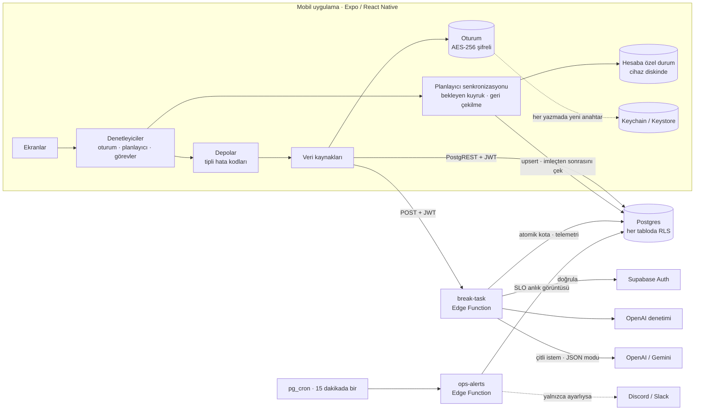

<p align="center">
  
</p>

<p align="center">
  <a href="https://github.com/ahmetHakanSenel/Minito/actions/workflows/ci.yml"></a>
  
  
  
  
</p>

<p align="center"><a href="../README.md">English</a> · <b>Türkçe</b></p>

Minito, DEHB dostu bir "başlama" uygulaması. Gözünüzde büyüyen bir görevi yazarsınız; uygulama size
üç şey döndürür:

- Sizi anladığını gösteren bir cümle.
- Gülünç derecede kolay bir ilk hareket.
- Sakin bir odak ekranında teker teker gösterilen 3 ila 7 küçük adım.

Uygulama React Native ile yazıldı ve Supabase üzerinde çalışıyor. Bu belge işin mühendislik
tarafını anlatıyor: sistem arıza anında nasıl güvenli kalıyor, her iddia nasıl test ediliyor ve
canlıda nasıl işletiliyor.

<p align="center">
  
</p>

## İnceleyenler için: nereye bakmalı

| İddia | Kanıt |
| ----- | ----- |
| **Yapay zekâ bütçesi boşaltılamaz**: ne eş zamanlı isteklerle ne de hesap silip yeniden açarak | [`014_atomic_rate_limits.sql`](../supabase/migrations/014_atomic_rate_limits.sql). Veritabanı testi, 20'lik bir kotaya aynı anda 60 çağrı gönderir ve her seferinde tam 20 izin alır |
| **Modele iki yönde de güvenilmez** | [`pipeline.ts`](../supabase/functions/break-task/pipeline.ts): etiketlerle kırılamayan bir veri çiti, zod sözleşmesi, tek onarım ve deterministik yedek plan |
| **İstek akışındaki her kural ağ olmadan test edilir** | [`handler.ts`](../supabase/functions/break-task/handler.ts) tüm yan etkileri bağımlılık olarak alır; [`handler.test.ts`](../supabase/functions/break-task/handler.test.ts) kimlik doğrulama, sıralama, hata durumunda açık kalma ve hata yollarını kapsar |
| **Eski kalmış cihazlara dayanıklı, çevrimdışı öncelikli senkronizasyon** | [`syncEngine.ts`](../src/features/planner/syncEngine.ts) ve [`016_planner_sync.sql`](../supabase/migrations/016_planner_sync.sql): tekrarlanabilir gönderimler, silme işaretleri, eski yazmaları reddeden sunucu tarafı koruma |
| **RLS ve yetkiler varsayılmaz, doğrulanır** | Migration'lar, Supabase'in varsayılan yetkileri birebir kurulmuş gerçek bir Postgres üzerinde çalıştırılır ([`bootstrap.sql`](../supabase/tests/bootstrap.sql)). Şema geneli kontroller, RLS'siz tabloda ya da `search_path`'i sabitlenmemiş fonksiyonda testi kırar |
| **Sistem işletilebilir** | [`RUNBOOK.md`](RUNBOOK.md): SLO'lar, hata bütçesi, günlük olayları, uyarı kuralları, olay senaryoları, genişlet/daralt yayınları. Arkasındaki SQL CI'da çalışır |
| **Güvenlik üzerine düşünülmüştür** | [`THREAT_MODEL.md`](THREAT_MODEL.md): her biri kendi önlemine ve onu kanıtlayan teste bağlanmış 23 tehdit; ayrıca ne zaman yeniden ele alınacağı belli, bilinçli olarak kabul edilmiş riskler |
| **İstem değişiklikleri ölçümle değerlendirilir** | [`scripts/eval.ts`](../scripts/eval.ts) ve kayıtlı [temel ölçüm](eval/README.md#baseline) |

---

## Mimari



- **Uygulama katmanları.** Veri kaynakları, depolar, denetleyiciler ve arayüz ayrı işler yapar.
  Tipli hatalar her katmandan geçer; bu yüzden arka uç eksikse uygulama çökmez, giriş ekranı
  durumu açıklar.
- **Planlayıcı.** Ekranlar yalnızca cihazdaki durumu gösterir. Bu yüzden planlayıcı çevrimdışı da
  çalışır ve hiç yükleniyor göstergesi göstermez.

---

## Yapay zekâ hattı

<p align="center">
  
</p>

| Aşama | Ne olur |
| ----- | ------- |
| **Giriş kontrolleri** | Önce kurulumun hazır olup olmadığına bakılır (`503`); böylece anonim sağlık yoklaması yanlış yapılandırılmış bir kurulumu görür. Sonra JWT (`401`) ve istek gövdesi (`400`; metin uzunluk kontrolünden önce kırpılır) |
| **Denetim ve kota** | İkisi paralel çalışır. Güvenlik kotadan önce gelir; IP kotası kullanıcı kotasından önce kontrol edilir. İkisi de hata durumunda açık kalır ve her hata günlüğe yazılır |
| **Çit** | Kullanıcı metnindeki her `<` ve `>`, `‹ ›` olur. Etiket adlarını silmek yetmez: tek geçişte silmek yeni bir etiket oluşturabilir (`</task_</task_input>input>`) |
| **Üretim** | Sağlayıcının JSON modu, çağrı başına 9 sn; ağ hatası ya da 5xx durumunda bir kez yeniden deneme. `429` asla yeniden denenmez |
| **Doğrulama ve onarım** | Zod sözleşmesi: 3–7 adım, ilk adım `easy`, her adım 1–10 dakika. Sözleşmeyi bozan yanıta tam bir onarım isteği gider. Sorunlar günlüğe model çıktısını alıntılamayacak biçimde yeniden yazılır |
| **Yedek plan** | Görevin dilinde deterministik bir plan. Modül yüklenirken doğrulanır; bozuk bir yedek plan kullanıcıyı değil, yayını durdurur |

Yanıtlanan her istek, yanıt gönderildikten sonra bir telemetri satırı yazar. Satırda şunlar
bulunur:

- Model ve istem sürümü.
- Model gecikmesi ve uçtan uca gecikme.
- Önbellekten gelenler dahil jeton dağılımı.
- Modelin neden durduğu ve varsa bozulan sözleşme kuralı.
- Yanıtın görevin diliyle eşleşip eşleşmediği.

Kullanıcı bir planı tek dokunuşla puanlayabilir. Puan, yalnızca çağıranın kendi satırına yazabilen
bir `SECURITY DEFINER` fonksiyonundan geçer.

**Çevrimdışı değerlendirme.** `npm run eval:ai`, sabit 20 Türkçe ve İngilizce görevi gerçek hattan
geçirir. Kayıtlı `gpt-4o-mini` temel ölçümü:

- 20/20 ilk denemede geçerli; 20/20 doğru dilde.
- Model gecikmesi: p50 3,5 sn, p95 6,5 sn.
- Tüm çalıştırmanın maliyeti bir sentin altında.

---

## Güvenilirlik ve operasyon

Her bağımlılığın arızada ne yapacağı tanımlıdır. Hepsinin arkasındaki ilke şu: başlamakta
zorlanan biri için, hata mesajı yerine hemen gelen sakin ve genel bir plan daha iyidir.

| Bu çökerse | Sistem | Kullanıcı ne görür |
| ---------- | ------ | ------------------ |
| Model sağlayıcı | Bir kez yeniden dener, sonra 17 sn'lik bütçe içinde `503 AI_DOWN` döner | Çevrimdışı adımlar ve sessiz bir bildirim |
| Model çıktısı | Bir onarım dener, sonra deterministik plana geçer | Genel ama kullanılabilir bir plan |
| İçerik denetimi | 3 sn sonra açık kalır ve bunu günlüğe yazar | Hiçbir şey |
| Kota kontrolü | Açık kalır ve hata olarak günlüğe yazar; son güvence sağlayıcıdaki harcama sınırıdır | Hiçbir şey |
| Supabase Auth | `401` değil, `503` döner | Çevrimdışı adımlar; **kimsenin oturumu kapanmaz** |
| Telemetri yazımı | Yanıttan sonra yeniden dener; ekleme tekrarlanabilir | Hiçbir şey |
| Planlayıcı için ağ | Düzenlemeler cihazda sıraya girer, geri çekilerek yeniden denenir | Hiçbir şey; planlayıcı kullanılmaya devam eder |

**SLO'lar (28 günlük pencere):**

- **Erişilebilirlik:** Uygun isteklerin %99'u bir planla yanıtlanır.
- **Gecikme:** Planların %95'i 12 sn içinde gelir.
- **Kalite:** Planların %97'si yedek plandan değil, modelden gelir.

**Uyarılar.** `ops-alerts` 15 dakikada bir erişilebilirliği, kaliteyi, gecikmeyi, hata bütçesini ve
harcamayı değerlendirir. Üç özelliği var:

- **Düşük trafikte gürültü yok.** Her kural, tetiklenebilmek için en az belirli sayıda örnek ister.
- **Yalnızca değişimde bildirim.** Bir kural tetiklendiğinde, tetikli kaldığı sürece 6 saatte bir
  ve düzeldiğinde haber verilir.
- **Varsayılan olarak kapalı.** Webhook tanımlanana kadar hiçbir mesaj gönderilmez.

Hedeflerin nasıl seçildiği, günlük olayları kataloğu ve yukarıdaki her satır için bir olay senaryosu
[el kitabında](RUNBOOK.md).

---

## Çevrimdışı öncelikli planlayıcı senkronizasyonu

```mermaid
sequenceDiagram
  autonumber
  participant UI as Planlayıcı ekranı
  participant Local as Cihazdaki durum
  participant Engine as Senkronizasyon motoru
  participant DB as Postgres
  UI->>Local: Düzenle (anında, çevrimdışı da çalışır)
  Local-->>UI: Cihazdaki durumdan yeniden çiz
  Engine->>DB: Bekleyen satırları gönder (önce projeler, sonra görevler; 100'lük gruplar)
  Note over DB: Tetikleyici, satırdan eski yazmaları atlar,<br/>cihaz saatini sınırlar, updated_at'i sunucu saatiyle yazar
  Engine->>DB: İmleç − 60 sn'den bu yana değişenleri çek
  DB-->>Engine: Satırlar ve silme işaretleri
  Engine->>Local: Birleştir; bekleyen yerel düzenlemeler önceliklidir
```

| Garanti | Nasıl |
| ------- | ----- |
| Yeniden gönderim kopya oluşturmaz | Kimlikler cihazda üretilir; yeniden deneme, aynı satırın tekrar yazılmasıdır |
| Silmeler çevrimdışı cihazlara ulaşır | Silinen satırlar işaretlenir ve 30 gün sonra temizlenir |
| Eski kalmış bir cihaz yeni düzenlemelerin üzerine yazamaz | Tetikleyici `client_updated_at` değerini karşılaştırıp eski yazmaları atlar. Geleceğe kurulmuş saatler sınırlanır |
| Gönderim sırasında yapılan düzenleme kaybolmaz | Her bekleyen değişiklik sürümlüdür; gönderim yalnızca gönderdiği sürümü temizler |
| Tek bir hatalı satır kuyruğu tıkayamaz | Reddedilen grup satır satır yeniden denenir; kalıcı hatalar ayıklanır |
| Sayfa ya da işlem sınırında satır kaçmaz | Çekme işlemi imlecin biraz gerisinden başlar; birleştirme tekrarlanabilir |
| Görevler sahibinden ayrılmaz | RLS'nin üstünde bileşik yabancı anahtar `(project_id, user_id)` |

---

## Güvenlik

Temel noktalar aşağıda. Ayrıntılı analiz [`THREAT_MODEL.md`](THREAT_MODEL.md) içinde.

- **Veritabanında en az yetki.**
  - Her tabloda RLS açık; her fonksiyon `search_path`'ini sabitler.
  - Ayrıcalıklı fonksiyonların yetkisi `anon` ve `authenticated` rollerinden açıkça alınır.
    Supabase bu iki role varsayılan olarak yetki verir; bir test, bu işlemin gerçekten gerekli
    olduğunu kanıtlar.
- **Yapay zekâya yalnızca oturum açmış kullanıcı erişir.**
  - Kotalar atomiktir ve hesaba bağlı değildir; hesabı silip yeniden açmak kotayı sıfırlamaz.
- **Gerekmeyen metin saklanmaz.**
  - Görev metni yalnızca HMAC özeti olarak tutulur.
  - Günlüklerde yalnızca kimlikler, sayılar ve süreler bulunur.
  - Kullanılmayan kişisel veri (IP özetleri, misafir kimlikleri) şemadan kaldırıldı.
- **Çökmeye dayanıklı, şifreli oturum.**
  - AES-256; her yazmada yeni anahtar, anahtar Keychain/Keystore'da.
  - Yazma sırası, herhangi bir adımda çökme olsa bile oturumun okunabilir kalacağı biçimde
    düzenlenmiştir.
  - Bir süreç kilidi, jeton yenilemelerini sıraya sokar.
- **Gizlilik hakları.**
  - Dışa aktarım hesabı, geçmişi, planlayıcıyı ve yapay zekâ istek kaydını kapsar.
  - Hesap silindiğinde sunucudaki veri zincirleme silinir; cihazdaki kopya da temizlenir.
  - Telemetri 90 gün sonra silinir.

---

## Testler

| Paket | Test | Neyi kanıtlar |
| ----- | ---: | ------------- |
| Uygulama (Jest) | 120 | Planlayıcı modeli, senkronizasyon motoru ve zamanlayıcısı; API istemcisinin her HTTP durumunda nasıl geri çekildiği; çökmeye dayanıklı oturum depolama; her statik `t()` anahtarı dahil çeviri eşitliği |
| Edge Functions (Deno) | 76 | İstek akışındaki sıralama ve hata kuralları, yapay zekâ sözleşmesi ve onarım, sağlayıcı zaman aşımları ve yeniden denemeler, denetimin açık kalması, Auth kesintisi, uyarı kuralları ve bildirim geçişleri |
| Veritabanı (Postgres) | 37 | Kullanıcılar arası RLS, Supabase varsayılanları altında yetkiler, kota eş zamanlılığı, zincirleme silmeler, planlayıcı korumaları, şema geneli kurallar, el kitabındaki SQL |
| Şema sapması | | Kayıtlı TypeScript tipleri, migration'ların ürettiğiyle birebir aynı |
| Gizli bilgiler | | Tüm git geçmişinde gitleaks taraması |

Veritabanı testlerinin gerçek hataları yakaladığını görmek için elle beş hata eklendi; her biri
testleri kırdı:

- Eksik bir `REVOKE`.
- Önce sayıp sonra yazan bir kota.
- `search_path`'i sabitlenmemiş bir fonksiyon.
- Planlayıcı satırlarında eski yazma korumasının olmaması.
- Bileşik anahtar yerine düz bir yabancı anahtar.

<details>
<summary><b>Mühendislik kararları ve ödünleşimler</b></summary>

**Hız sınırı neden atomik bir SQL fonksiyonu?** İlk sürüm telemetri satırlarını sayıyordu. Bu
satırlar yapay zekâ çağrısı bittikten sonra yazıldığı için eş zamanlı istekler birbirini
göremiyordu; satırlar hesapla birlikte silindiği için de kota sıfırlanıyordu. Tek bir
`INSERT … ON CONFLICT DO UPDATE` yarışı ortadan kaldırıyor; kullanıcıya bağlı olmayan bir tablo da
sıfırlanmayı. Sabit pencere, sınırda kotanın iki katına kadar isteğin geçmesine izin verebilir. Bir
bütçe koruması için bu, çağıran başına tek satır ve tek ifadeye değer.

**İşleyici bağımlılıklarını neden dışarıdan alıyor?** Böylece sıralama kuralları test edilebiliyor:
güvenlik kotadan önce, IP kullanıcıdan önce, hazır olma denetimi kimlik doğrulamadan önce. Bunlar
en önemli ve yeniden düzenlemede en kolay bozulan kurallar.

**Kota ve denetim neden hata durumunda açık kalıyor?** Başlamakta zaten zorlanan biri, bir
veritabanı aksaklığı yüzünden kapıda kalmamalı. Her hata, alarm üretebilecek düzeyde günlüğe
yazılır; kesin üst sınırı sağlayıcıdaki harcama limiti belirler.

**Auth çökünce neden `503`?** Uygulama `401`'i "oturumun sona erdi" diye yorumlar. Bir Auth
kesintisinde `401` dönmek, tüm aktif kullanıcıların oturumunu aynı anda kapatırdı.

**Planlayıcıda neden silme işaretleri ve "son yazan kazanır"?** Bir planlayıcı satırı bir başlık ya
da bir onay kutusu; alanları birleştirmek değer katmadan karmaşıklık ekler. Silme işaretleri ve
sunucu tarafındaki eski yazma koruması, cihazlar arası koordinasyon gerekmeden doğru silme ve
sıralama sağlar.

**Neden genişlet/daralt migration'ları?** Migration 015, bir önceki fonksiyon sürümünün hâlâ
yazdığı sütunları kaldırır. Önce ekle, sonra yayınla, en son kaldır sırası, her adımı o anda
çalışan kodla uyumlu tutar.

**Uyarılar neden en az örnek sayısı istiyor?** Üç istekte tek bir hata, %67 erişilebilirlik gibi
görünür. Boş yere çalan alarm, insanlara alarmları görmezden almayı öğretir.

**Neden sürekli görünen bir durum göstergesi yok?** Bu kitle için yanıp sönen bir durum etiketi
gürültüdür. Uygulama arka planda sessizce kontrol eder ve yalnızca gerçekten bir sorun varsa
konuşur.

</details>

---

## Teknolojiler

| Alan | Seçimler |
| ---- | -------- |
| Uygulama | Expo SDK 54, React Native 0.81 (New Architecture), React 19, katı TypeScript, Expo Router 6, Reanimated 4, Skia, expo-audio |
| Arka uç | Supabase Auth, Postgres (RLS, `pg_cron`, `pg_net`), Deno Edge Functions |
| Yapay zekâ | OpenAI `gpt-4o-mini` ya da Gemini (bir gizli değerle değiştirilebilir); OpenAI denetimi |
| Kalite | Jest, Deno test, Postgres üzerinde `node:test`, ESLint (sıfır uyarı), Prettier |
| Operasyon | Yapılandırılmış JSON günlükleri, SQL ile SLO göstergeleri ve hata bütçesi, `ops-alerts`, Sentry (yalnızca anonim kimlikler) |
| CI | GitHub Actions: uygulama, Edge Functions, tip sapması denetimli veritabanı, gitleaks; Dependabot |

## Başlarken

```bash
npm install
cp .env.example .env    # Supabase URL'si ve anon anahtarı
npm start
```

Arka uç tanımlı değilse uygulama, oturumu kapalı bir çevrimdışı modda açılır. Arka uç kurulumu,
giriş sağlayıcıları ve zamanlanmış işler [`SETUP.tr.md`](SETUP.tr.md) içinde.

| Komut | Ne yapar |
| ----- | -------- |
| `npm test` · `npm run test:edge` · `npm run test:db` | Üç test paketi |
| `npm run typecheck` · `lint` · `format:check` | Statik kontroller |
| `npm run gen:types` | Veritabanı tiplerini migration'lardan yeniden üretir |
| `npm run eval:ai` | Yapay zekâ hattının çevrimdışı değerlendirmesi |
| `npm run readme:assets` | Bu belgedeki görselleri koddan yeniden üretir |

## Bilinen sınırlamalar

- **iOS** henüz yayına hazır değil: paket kimliği ve Apple ile giriş yetkisi tanımlı değil, Apple
  kimlik jetonları nonce olmadan kullanılıyor.
- **Planlayıcıdaki çakışmalar** alan birleştirmeyle değil, satır başına son yazmayla çözülüyor.
- **Oturum şifrelemesi** AES-CTR kullanıyor: gizlilik sağlıyor ama bütünlük etiketi yok.
- **Günlük tabanlı uyarılar** (örneğin `quota_check_failed`) platformun günlük gezginine dayanıyor.
  Zamanlanmış kurallar yalnızca veritabanına yazılanı görüyor.
