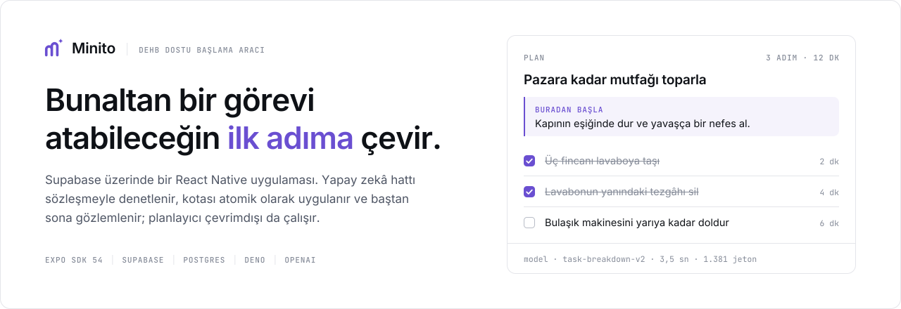
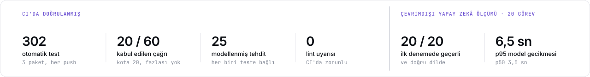
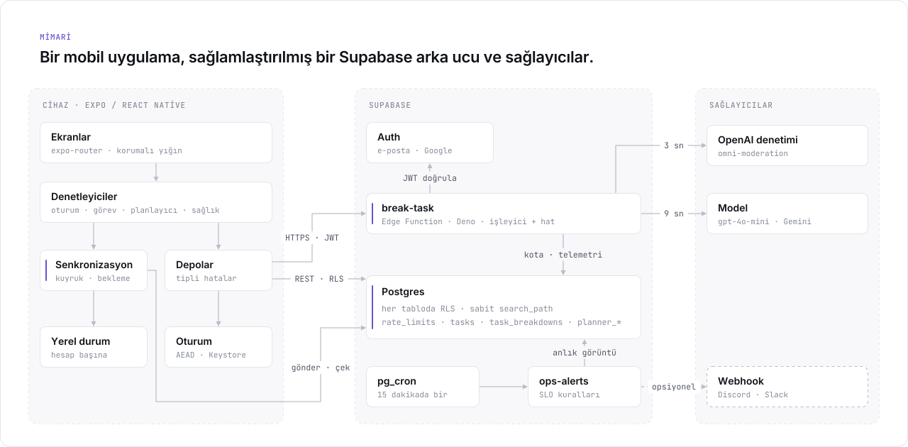
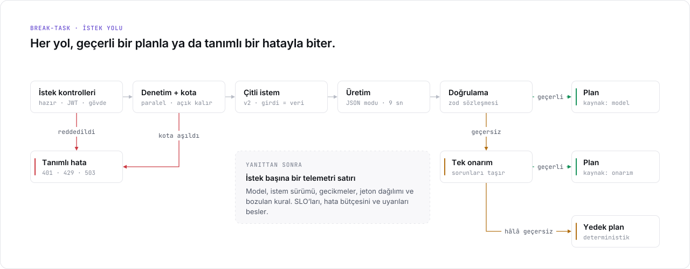
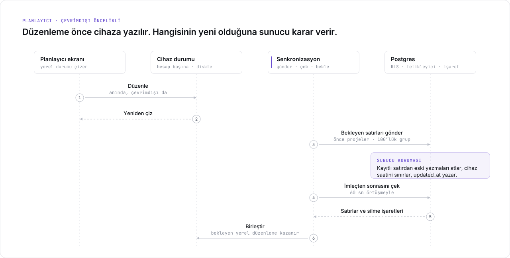

<p align="center">
  <picture>
    <source media="(prefers-color-scheme: dark)" srcset="assets/hero-tr-dark.svg">
    
  </picture>
</p>

<p align="center"><b>Gözünüzde büyüyen bir işi, gülünç derecede kolay tek bir ilk adıma çevirir.</b></p>

<p align="center">
  Minito, sağlamlaştırılmış bir Supabase arka ucu üzerinde çalışan, çevrimdışı öncelikli bir
  React Native uygulaması; yapay zekâ hattı çitli, doğrulanmış ve ölçülmüş.
</p>

<p align="center">
  <a href="https://github.com/ahmetHakanSenel/Minito/actions/workflows/ci.yml"></a>
  
  
  
  
</p>

<p align="center"><a href="../README.md">English</a> · <b>Türkçe</b></p>

## Ne yapar

Gözünüzde büyüyen bir şeyi yazarsınız — "pazara kadar mutfağı toplamam lazım" — ve Minito üç şeyle
karşılık verir: anladığını gösteren bir cümle, birkaç saniye süren bir ilk hareket ve sakin bir
odak ekranında teker teker gösterilen 3 ila 7 küçük adım. Her adımın gerçekçi bir süresi vardır ve
her adım, bırakmanın da sorun olmadığını açıkça söyleyerek biter.

Geçmiş, ilerleme ve proje planlayıcısı cihazlar arasında senkronize olur, çevrimdışıyken de
çalışmaya devam eder.

<!--
  Ürün ekran görüntüleri buraya. Dosyalar docs/assets/ içine konduktan sonra yorumu kaldırın:

<p align="center">
  
</p>
-->

<p align="center">
  <picture>
    <source media="(prefers-color-scheme: dark)" srcset="assets/numbers-tr-dark.svg">
    
  </picture>
</p>

> **Bu rakamlar ne.** Soldaki grup, her push'ta test paketlerinin ürettiği sonuçlar. Sağdaki grup,
> gerçek hat üzerinde 20 görevle çalıştırılan ve depoya kaydedilmiş çevrimdışı ölçümden geliyor.
> Aşağıdaki servis seviyesi hedefleri ise bir üretim yükü için tanımlanmış hedefler; ölçüm değil.
> Bu depo hiçbir zaman üretim trafiği taşımadı.

Belgenin geri kalanı mühendislik tarafını anlatıyor: sistem arıza anında nasıl güvenli kalıyor, her
iddia nasıl test ediliyor ve nasıl işletilecek.

## İnceleyenler için: nereye bakmalı

| İddia | Kanıt |
| ----- | ----- |
| **Eş zamanlı istekler tanımlı kotayı aşamaz**, hesap silip yeniden açmak da kotayı sıfırlamaz | [`014_atomic_rate_limits.sql`](../supabase/migrations/014_atomic_rate_limits.sql). Veritabanı testi, 20'lik bir kotaya aynı anda 60 çağrı gönderir ve her seferinde tam 20 izin alır |
| **Modele iki yönde de güvenilmez** | [`pipeline.ts`](../supabase/functions/break-task/pipeline.ts): etiketlerle kırılamayan bir veri çiti, zod sözleşmesi, tek onarım ve deterministik yedek plan |
| **İstek akışındaki her kural ağ olmadan test edilir** | [`handler.ts`](../supabase/functions/break-task/handler.ts) tüm yan etkileri bağımlılık olarak alır; [`handler.test.ts`](../supabase/functions/break-task/handler.test.ts) kimlik doğrulama, sıralama, hata durumunda açık kalma ve hata yollarını kapsar |
| **Eski kalmış cihazlara dayanıklı, çevrimdışı öncelikli senkronizasyon** | [`syncEngine.ts`](../src/features/planner/syncEngine.ts) ve [`016_planner_sync.sql`](../supabase/migrations/016_planner_sync.sql): tekrarlanabilir gönderimler, silme işaretleri, eski yazmaları reddeden sunucu tarafı koruma |
| **RLS ve yetkiler varsayılmaz, doğrulanır** | Migration'lar, Supabase'in varsayılan yetkileri birebir kurulmuş gerçek bir Postgres üzerinde çalıştırılır ([`bootstrap.sql`](../supabase/tests/bootstrap.sql)). Şema geneli kontroller, RLS'siz tabloda ya da `search_path`'i sabitlenmemiş fonksiyonda testi kırar |
| **Sistem işletilebilir** | [`RUNBOOK.md`](RUNBOOK.md): SLO'lar, hata bütçesi, günlük olayları, uyarı kuralları, olay senaryoları, genişlet/daralt yayınları. Arkasındaki SQL CI'da çalışır |
| **Güvenlik üzerine düşünülmüştür** | [`THREAT_MODEL.md`](THREAT_MODEL.md): her biri kendi önlemine ve onu kanıtlayan teste bağlanmış 25 tehdit; ayrıca ne zaman yeniden ele alınacağı belli, bilinçli olarak kabul edilmiş riskler |
| **İstem değişiklikleri ölçümle değerlendirilir** | [`scripts/eval.ts`](../scripts/eval.ts) ve kayıtlı [temel ölçüm](eval/README.md#baseline) |

---

## Mimari

<p align="center">
  <picture>
    <source media="(prefers-color-scheme: dark)" srcset="assets/architecture-tr-dark.svg">
    
  </picture>
</p>

- **Uygulama katmanları.** Veri kaynakları, depolar, denetleyiciler ve arayüz ayrı işler yapar.
  Tipli hatalar her katmandan geçer; bu yüzden arka uç eksikse uygulama çökmez, giriş ekranı
  durumu açıklar.
- **Planlayıcı.** Ekranlar yalnızca cihazdaki durumu gösterir. Bu yüzden planlayıcı çevrimdışı da
  çalışır ve hiç yükleniyor göstergesi göstermez.

---

## Yapay zekâ hattı

<p align="center">
  <picture>
    <source media="(prefers-color-scheme: dark)" srcset="assets/pipeline-tr-dark.svg">
    
  </picture>
</p>

| Aşama | Ne olur |
| ----- | ------- |
| **Giriş kontrolleri** | Önce kurulumun hazır olup olmadığına bakılır (`503`); böylece anonim sağlık yoklaması yanlış yapılandırılmış bir kurulumu görür. Sonra JWT (`401`) ve istek gövdesi (`400`; metin uzunluk kontrolünden önce kırpılır) |
| **Denetim ve kota** | İkisi paralel çalışır. Güvenlik kotadan önce gelir. Kriz desteğiyle yalnızca kendine zarar içeriği karşılanır; denetimin işaretlediği diğer her şey sade bir dille reddedilir. Kullanıcı kotası IP kotasından önce kontrol edilir; böylece hesabı nedeniyle reddedilen bir istek, paylaşılan ve kısmen istemcinin belirlediği IP bütçesini hiç harcamaz. İkisi de hata durumunda açık kalır ve her hata günlüğe yazılır |
| **Çit** | Kullanıcı metnindeki her `<` ve `>`, `‹ ›` olur. Etiket adlarını silmek yetmez: tek geçişte silmek yeni bir etiket oluşturabilir (`</task_</task_input>input>`) |
| **Üretim** | Sağlayıcının JSON modu, çağrı başına 9 sn; ağ hatası ya da 5xx durumunda bir kez yeniden deneme. `429` asla yeniden denenmez |
| **Doğrulama ve onarım** | Zod sözleşmesi: 3–7 adım, ilk adım `easy`, her adım 1–10 dakika. Sözleşmeyi bozan yanıta tam bir onarım isteği gider. Sorunlar günlüğe model çıktısını alıntılamayacak biçimde yeniden yazılır |
| **Yedek plan** | Görevin dilinde deterministik bir plan. Modül yüklenirken doğrulanır; bozuk bir yedek plan kullanıcıyı değil, yayını durdurur |

**Planın hangi dilde döndüğü.** Görevin kendisi karar verir: Türkçe bir uygulamada İngilizce
yazan biri İngilizce plan alır. Görev dilini belli edemeyecek kadar kısaysa — "kargo", "taxes" —
uygulamanın çalıştığı dil karar verir; çünkü istemci bunu kesin olarak bilir, sunucu ise bir avuç
karakterden tahmin etmek zorunda kalır. Eskiden İngilizce tahmin ediyordu; içinde Türkçe harf
geçmeyen bir Türkçe görevin İngilizce dönmesinin sebebi buydu.

Yanıtlanan her istek, yanıt gönderildikten sonra bir telemetri satırı yazar. Satırda şunlar
bulunur:

- Model ve istem sürümü.
- Model gecikmesi ve uçtan uca gecikme.
- Önbellekten gelenler dahil jeton dağılımı.
- Modelin neden durduğu ve varsa bozulan sözleşme kuralı.
- Yanıtın istenen dille eşleşip eşleşmediği.

Kullanıcı bir planı tek dokunuşla puanlayabilir. Puan, yalnızca çağıranın kendi satırına yazabilen
bir `SECURITY DEFINER` fonksiyonundan geçer.

**Çevrimdışı değerlendirme.** Sabit 20 Türkçe ve İngilizce görev gerçek hattan geçirilir; böylece
bir istem ya da model değişikliği ölçümle değerlendirilir. Kayıtlı `gpt-4o-mini` temel ölçümü:

- 20/20 ilk denemede geçerli; 20/20 doğru dilde.
- Model gecikmesi: p50 3,5 sn, p95 6,5 sn.
- Tüm çalıştırmanın maliyeti bir sentin altında.

Yirmi görev bir kıyaslama değil, bir duman testi: iki istem sürümü arasındaki bir gerilemeyi
yakalamak için var ve bunu söyleyecek kadar küçük.

---

## Güvenilirlik ve operasyon

Her bağımlılığın arızada ne yapacağı tanımlıdır. Hepsinin arkasındaki ilke şu: başlamakta
zorlanan biri için, hata mesajı yerine hemen gelen sakin ve genel bir plan daha iyidir.

| Bu çökerse | Sistem | Kullanıcı ne görür |
| ---------- | ------ | ------------------ |
| Model sağlayıcı | Bir kez yeniden dener, sonra 17 sn'lik bütçe içinde `503 AI_DOWN` döner | Çevrimdışı adımlar ve sessiz bir bildirim |
| Model çıktısı | Bir onarım dener, sonra deterministik plana geçer | Genel ama kullanılabilir bir plan |
| İçerik denetimi | 3 sn sonra açık kalır ve bunu günlüğe yazar | Hiçbir şey |
| Kota kontrolü | Açık kalır ve hata olarak günlüğe yazar; son güvence sağlayıcıdaki harcama sınırıdır | Hiçbir şey |
| Supabase Auth | `401` değil, `503` döner | Çevrimdışı adımlar; **kimsenin oturumu kapanmaz** |
| Telemetri yazımı | Yanıttan sonra yeniden dener; ekleme tekrarlanabilir | Hiçbir şey |
| Planlayıcı için ağ | Düzenlemeler cihazda sıraya girer, geri çekilerek yeniden denenir | Hiçbir şey; planlayıcı kullanılmaya devam eder |

**Servis seviyesi hedefleri (28 günlük pencere).** Bunlar bir üretim yükü için tanımlanmış
hedefler. Üretim trafiği hiç taşınmadığı için aşağıdakilerin hiçbiri bir ölçüm değil:

- **Erişilebilirlik:** Uygun isteklerin %99'u bir planla yanıtlanır.
- **Gecikme:** Planların %95'i 12 sn içinde gelir.
- **Model yanıt oranı:** Planların %97'si yedek plandan değil, modelden gelir. Bu, planın nereden
  geldiğini sayar, ne kadar iyi olduğunu değil; plan kalitesi ayrıca ve çevrimdışı ölçülür.

Gerçek olan, bunları değerlendirecek düzenek: SLI sorguları CI'da gerçek bir Postgres üzerinde
çalışıyor, uyarı kuralları da birim testli.

**Uyarılar.** `ops-alerts` 15 dakikada bir erişilebilirliği, model yanıt oranını, gecikmeyi, hata
bütçesini ve harcamayı değerlendirir. Üç özelliği var:

- **Düşük trafikte gürültü yok.** Her kural, tetiklenebilmek için en az belirli sayıda örnek ister.
- **Yalnızca değişimde bildirim.** Bir kural tetiklendiğinde, tetikli kaldığı sürece 6 saatte bir
  ve düzeldiğinde haber verilir.
- **Varsayılan olarak kapalı.** Webhook tanımlanana kadar hiçbir mesaj gönderilmez.

Hedeflerin nasıl seçildiği, günlük olayları kataloğu ve yukarıdaki her satır için bir olay senaryosu
[el kitabında](RUNBOOK.md).

---

## Çevrimdışı öncelikli planlayıcı senkronizasyonu

<p align="center">
  <picture>
    <source media="(prefers-color-scheme: dark)" srcset="assets/sync-tr-dark.svg">
    
  </picture>
</p>

| Garanti | Nasıl |
| ------- | ----- |
| Yeniden gönderim kopya oluşturmaz | Kimlikler cihazda üretilir; yeniden deneme, aynı satırın tekrar yazılmasıdır |
| Silmeler çevrimdışı cihazlara ulaşır | Silinen satırlar işaretlenir ve 30 gün sonra temizlenir. Üç haftadan uzun süre uzak kalan bir cihaz son değişiklikleri çekmek yerine sunucunun tüm durumundan yeniden kurulur; böylece işareti çoktan temizlenmiş bir silmeyi kaçıramaz |
| Eski kalmış bir cihaz yeni düzenlemelerin üzerine yazamaz | Tetikleyici `client_updated_at` değerini karşılaştırıp eski yazmaları atlar. Geleceğe kurulmuş saatler sınırlanır |
| Gönderim sırasında yapılan düzenleme kaybolmaz | Her bekleyen değişiklik sürümlüdür; gönderim yalnızca gönderdiği sürümü temizler |
| Tek bir hatalı satır kuyruğu tıkayamaz | Reddedilen grup satır satır yeniden denenir; kalıcı hatalar ayıklanır |
| Sayfa ya da işlem sınırında satır kaçmaz | Çekme işlemi imlecin biraz gerisinden başlar; birleştirme tekrarlanabilir |
| Görevler sahibinden ayrılmaz | RLS'nin üstünde bileşik yabancı anahtar `(project_id, user_id)` |

---

## Güvenlik

İstemciye güvenilmez. Modelin çıktısına güvenilmez. Ayrıcalıklı veritabanı fonksiyonlarının kapsamı
varsayılana bırakılmaz, açıkça çizilir. Aşağıdaki her madde bir teste dayanıyor; ayrıntılı analiz
[`THREAT_MODEL.md`](THREAT_MODEL.md) içinde.

- **Veritabanında en az yetki.**
  - Her tabloda RLS açık; her fonksiyon `search_path`'ini sabitler.
  - Ayrıcalıklı fonksiyonların yetkisi `anon` ve `authenticated` rollerinden açıkça alınır.
    Supabase bu iki role varsayılan olarak yetki verir; bir test, bu işlemin gerçekten gerekli
    olduğunu kanıtlar.
- **Yapay zekâya yalnızca oturum açmış kullanıcı erişir.**
  - Kotalar atomiktir ve hesaba bağlı değildir; hesabı silip yeniden açmak kotayı sıfırlamaz.
- **Gerekmeyen metin saklanmaz.**
  - İstek kaydı her görevin metnini değil, HMAC özetini tutar. Metnin kendisi yalnızca kişinin
    ona geri ihtiyaç duyduğu yerde — kendi geçmişinde ve planlayıcısında — her satırı sahibine
    bağlayan RLS'nin arkasında saklanır ve hesapla birlikte silinir.
  - Günlüklerde yalnızca kimlikler, sayılar ve süreler bulunur.
  - IP yalnızca bir kota sayacının içinde HMAC olarak tutulur. Kullanılmayan kişisel veri (IP
    sütunları, misafir kimlikleri) şemadan kaldırıldı.
- **Kimliği doğrulanan, çökmeye dayanıklı oturum deposu.**
  - XChaCha20-Poly1305 (AEAD); her yazmada yeni anahtar ve nonce, anahtar Keychain/Keystore'da.
  - Şifreli veri, yazıldığı depolama yuvasına ve anahtar kimliğine bağlıdır. Tek bir bitin
    değişmesi, verinin kısaltılması ya da başka yere taşınması çözmeyi başarısız kılar; kullanıcı
    değiştirilmiş veriyle değil, yeniden girişle karşılaşır.
  - Yazma sırası, herhangi bir adımda çökme olsa bile oturumun okunabilir kalacağı biçimde
    düzenlenmiştir; bir süreç kilidi de jeton yenilemelerini sıraya sokar.
- **Tekrar oynatmaya dayanıklı Apple girişi.**
  - Her denemede yeni bir 256 bitlik nonce üretilir. Apple yalnızca SHA-256 özetini alır; Supabase
    ham değeri jetonla karşılaştırır. Ele geçirilmiş bir jeton yeniden kullanılamaz.
- **Gizlilik hakları.**
  - Dışa aktarım hesabı, geçmişi, planlayıcıyı ve yapay zekâ istek kaydını kapsar.
  - Hesap silindiğinde sunucudaki veri zincirleme silinir; cihazdaki kopya da temizlenir.
  - Telemetri 90 gün sonra silinir.

---

## Testler

| Paket | Test | Neyi kanıtlar |
| ----- | ---: | ------------- |
| Uygulama (Jest) | 210 | Planlayıcı modeli, senkronizasyon motoru ve zamanlayıcısı; API istemcisinin her HTTP durumunda nasıl geri çekildiği; kurcalamayı reddeden ve çökmeye dayanıklı oturum deposu; Apple nonce'u; süre çarkının, telefonu elde tutma tespitinin ve ses geçişlerinin aritmetiği; her statik `t()` anahtarı dahil çeviri eşitliği |
| Edge Functions (Deno) | 97 | İstek akışındaki sıralama ve hata kuralları, yapay zekâ sözleşmesi ve onarım, planın hangi dilde döndüğü, sağlayıcı zaman aşımları ve yeniden denemeler, denetimin açık kalması, Auth kesintisi, uyarı kuralları ve bildirim geçişleri |
| Veritabanı (Postgres) | 36 | Kullanıcılar arası RLS, Supabase varsayılanları altında yetkiler, kota eş zamanlılığı, zincirleme silmeler, planlayıcı korumaları, şema geneli kurallar, el kitabındaki SQL |
| Şema sapması | | Kayıtlı TypeScript tipleri, migration'ların ürettiğiyle birebir aynı |
| Gizli bilgiler | | Tüm git geçmişinde gitleaks taraması |

Veritabanı testlerinin gerçek hataları yakaladığını görmek için elle beş hata eklendi; her biri
testleri kırdı:

- Eksik bir `REVOKE`.
- Önce sayıp sonra yazan bir kota.
- `search_path`'i sabitlenmemiş bir fonksiyon.
- Planlayıcı satırlarında eski yazma korumasının olmaması.
- Bileşik anahtar yerine düz bir yabancı anahtar.

<details>
<summary><b>Mühendislik kararları ve ödünleşimler</b></summary>

**Hız sınırı neden atomik bir SQL fonksiyonu?** İlk sürüm telemetri satırlarını sayıyordu. Bu
satırlar yapay zekâ çağrısı bittikten sonra yazıldığı için eş zamanlı istekler birbirini
göremiyordu; satırlar hesapla birlikte silindiği için de kota sıfırlanıyordu. Tek bir
`INSERT … ON CONFLICT DO UPDATE` yarışı ortadan kaldırıyor; kullanıcıya bağlı olmayan bir tablo da
sıfırlanmayı. Sabit pencere, sınırda kotanın iki katına kadar isteğin geçmesine izin verebilir. Bir
bütçe koruması için bu, çağıran başına tek satır ve tek ifadeye değer.

**İşleyici bağımlılıklarını neden dışarıdan alıyor?** Böylece sıralama kuralları test edilebiliyor:
güvenlik kotadan önce, kullanıcı kotası IP kotasından önce, hazır olma denetimi kimlik doğrulamadan önce. Bunlar
en önemli ve yeniden düzenlemede en kolay bozulan kurallar.

**Kota ve denetim neden hata durumunda açık kalıyor?** Başlamakta zaten zorlanan biri, bir
veritabanı aksaklığı yüzünden kapıda kalmamalı. Her hata, alarm üretebilecek düzeyde günlüğe
yazılır; kesin üst sınırı sağlayıcıdaki harcama limiti belirler.

**Auth çökünce neden `503`?** Uygulama `401`'i "oturumun sona erdi" diye yorumlar. Bir Auth
kesintisinde `401` dönmek, tüm aktif kullanıcıların oturumunu aynı anda kapatırdı.

**Planlayıcıda neden silme işaretleri ve "son yazan kazanır"?** Bir planlayıcı satırı bir başlık ya
da bir onay kutusu; alanları birleştirmek değer katmadan karmaşıklık ekler. Silme işaretleri ve
sunucu tarafındaki eski yazma koruması, cihazlar arası koordinasyon gerekmeden doğru silme ve
sıralama sağlar.

**Neden genişlet/daralt migration'ları?** Migration 015, bir önceki fonksiyon sürümünün hâlâ
yazdığı sütunları kaldırır. Önce ekle, sonra yayınla, en son kaldır sırası, her adımı o anda
çalışan kodla uyumlu tutar.

**Uyarılar neden en az örnek sayısı istiyor?** Üç istekte tek bir hata, %67 erişilebilirlik gibi
görünür. Boş yere çalan alarm, insanlara alarmları görmezden almayı öğretir.

**Neden sürekli görünen bir durum göstergesi yok?** Bu kitle için yanıp sönen bir durum etiketi
gürültüdür. Uygulama arka planda sessizce kontrol eder ve yalnızca gerçekten bir sorun varsa
konuşur.

**Süre çarkı neden kendi momentumunu hesaplamıyor?** Eskiden hesaplıyordu: yayla oturma, elle
yazılmış fırlatma hedefi, UI thread'de kaydırılan sonsuz bir şerit. Taklit ettiği her platform
jesti, ayarlanmadığı bir cihazda sessizce yanlış davranabilecek bir şey daha demekti. Artık satıra
oturan bir kaydırma görünümü: görsel olarak hiçbir şey kaybettirmiyor ve işletim sistemine karşı
değil, onunla birlikte yaşlanıyor.

</details>

---

## Bunlar iddia edilmiyor

Bir inceleyenin zaten bulacağı boşluklar. O yüzden burada yazıyorlar.

- **Üretim trafiği yok.** SLO'lar, hata bütçesi ve uyarı eşikleri birer tasarım hedefi. Arkalarındaki
  sorgular ve kurallar test ediliyor; tarif ettikleri yük ise varsayımsal.
- **Yapay zekâ değerlendirme kümesi 20 görev.** İstem sürümleri arasındaki bir gerilemeyi yakalamaya
  yeter, model kalitesini nitelemeye yetmez.
- **Android cihazda denendi, iOS denenmedi.** iOS yapılandırması var (paket kimliği, Apple ile
  giriş) ve proje derleniyor, ama şimdiye dek hiçbir iOS cihazında çalıştırılmadı.
- **Günlük tabanlı uyarılar** (örneğin `quota_check_failed`) platformun günlük gezginine dayanır.
  Zamanlanmış kurallar yalnızca veritabanına yazılanı görür.
- **Kota ve denetim hata durumunda açık kalır**; bu bilinçli. İkisinden birinde kesinti olduğunda
  kesin üst sınırı sağlayıcıdaki harcama limiti çizer. Sabit pencere, pencere sınırında sınırın iki
  katına kadar isteğin geçmesine de izin verebilir.
- **Planlayıcıdaki çakışmalar** alan birleştirmeyle değil, satır başına son yazmayla çözülür. Bir
  silmenin işareti temizlendikten sonra silmenin kanıtı da yok olur; bu yüzden cihaz uzlaşmadan
  önce o satıra çevrimdışı yapılmış bir düzenleme, satırı geri getirir.
- **Saklama süreleri zamanlanmış işlere bağlıdır.** Telemetrinin silinmesi, kota sayaçlarının
  temizlenmesi ve silme işaretlerinin kaldırılması, runbook'ta listelenen `pg_cron` işleridir. Bu
  işler kurulmamış bir ortam o veriyi saklamaya devam eder.

Son üçü bilinçli birer tercih. Her biri, onu değiştirecek koşulla birlikte
[tehdit modelinde](THREAT_MODEL.md#accepted-risks) yazılı.

---

## Teknolojiler

| Alan | Seçimler |
| ---- | -------- |
| Uygulama | Expo SDK 57, React Native 0.86, React 19.2, TypeScript 6 (katı), Expo Router 6, Reanimated 4, Skia, expo-audio |
| Arka uç | Supabase Auth, Postgres (RLS, `pg_cron`, `pg_net`), Deno Edge Functions |
| Güvenlik | `@noble/ciphers` ile XChaCha20-Poly1305, `expo-secure-store` ile Keychain/Keystore, HMAC-SHA256, nonce'a bağlı Apple girişi |
| Yapay zekâ | OpenAI `gpt-4o-mini` ya da Gemini (bir gizli değerle değiştirilebilir); OpenAI denetimi |
| Kalite | Jest, Deno test, Postgres üzerinde `node:test`, ESLint (sıfır uyarı), Prettier |
| Operasyon | Yapılandırılmış JSON günlükleri, SQL ile SLO göstergeleri ve hata bütçesi, `ops-alerts`, Sentry (yalnızca anonim kimlikler) |
| CI | GitHub Actions: uygulama, Edge Functions, tip sapması denetimli veritabanı, gitleaks; Dependabot |

<details>
<summary><b>Proje yapısı</b></summary>

```
app/                              Expo Router ekranları; her biri kendi hata sınırını dışa aktarır
src/
  data/                           Supabase istemcisi, şifreli oturum deposu, giriş sağlayıcıları
  repositories/                   oturum, görevler, geri bildirim, sağlık
  features/planner/               çevrimdışı öncelikli senkronizasyon: model, motor, zamanlayıcı, depolama
  features/                       oturum, görevler, sağlık, ayarlar
  context/                        ses (expo-audio) ve planlayıcı sağlayıcısı
  lib/                            API istemcisi, i18n (EN/TR), dokunsal geri bildirim, izleme
supabase/
  functions/_shared/              HTTP ve kimlik doğrulama yardımcıları
  functions/break-task/           işleyici, yapay zekâ hattı, sağlayıcılar, denetim
  functions/ops-alerts/           SLO kuralları ve bildirim geçişleri
  functions/delete-user/          silinme hakkı
  functions/export-user-data/     erişim hakkı
  migrations/                     001–018
  tests/                          veritabanı testleri ve Supabase ortamı
scripts/                          değerlendirme düzeneği, marka ve README görselleri
docs/                             RUNBOOK, THREAT_MODEL, operasyon SQL'i, değerlendirme
```

</details>
